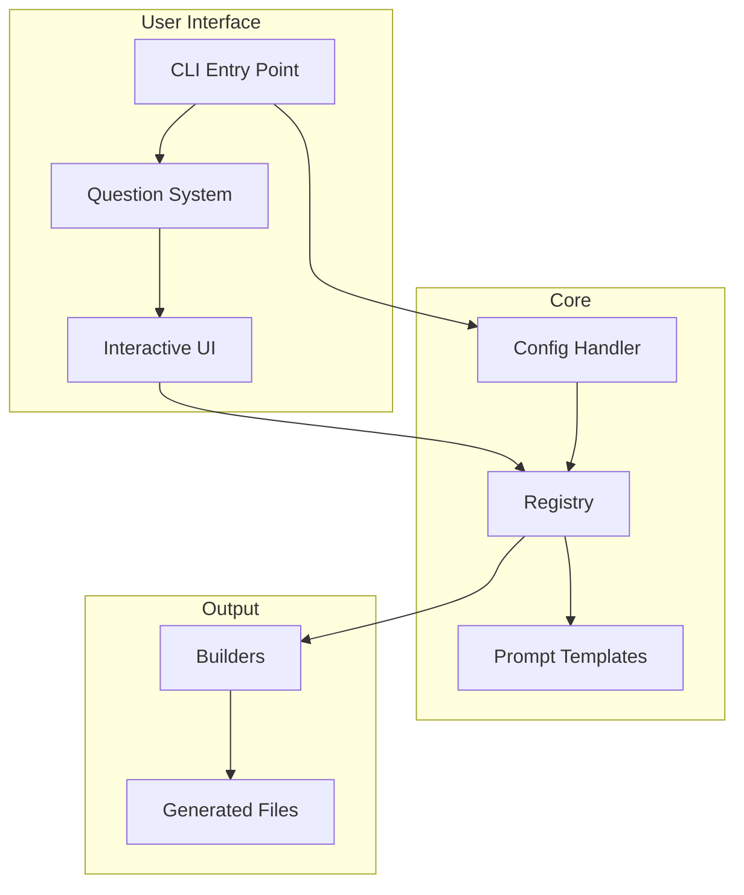
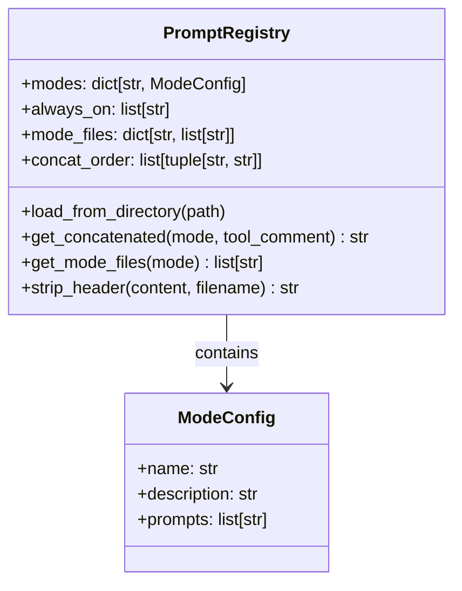
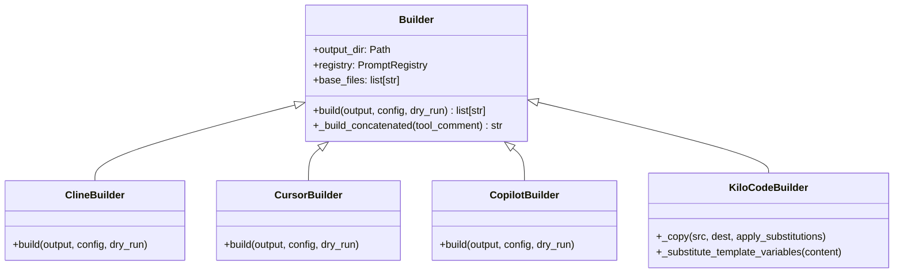
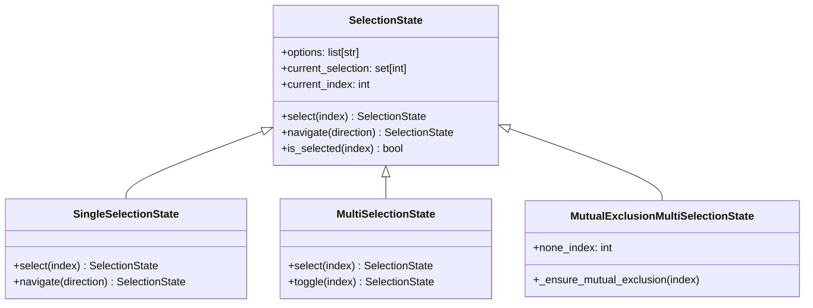
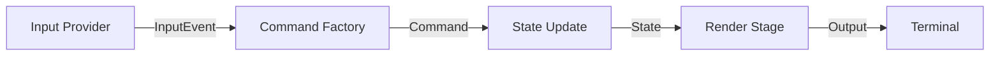
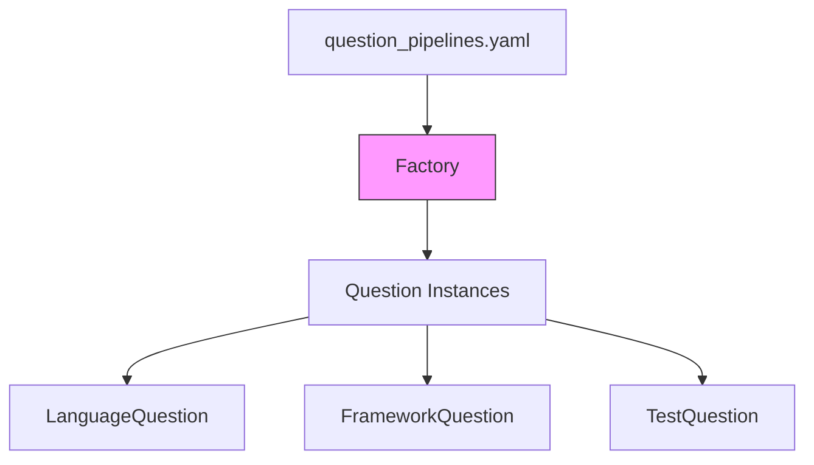
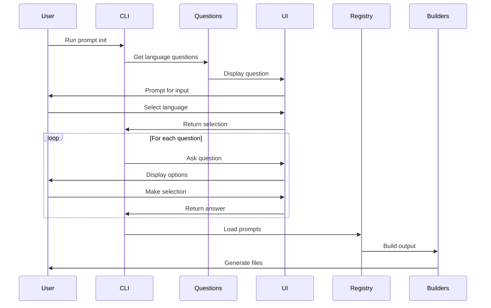
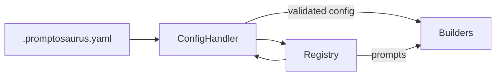
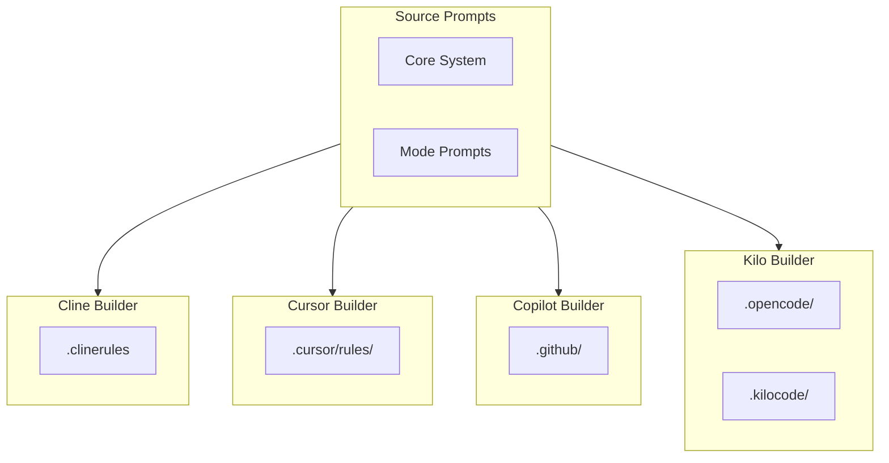
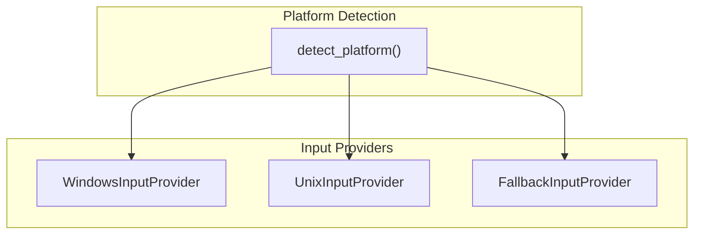

# Promptosaurus Architecture

Comprehensive technical documentation of the Promptosaurus system architecture, design decisions, and implementation details.

## Table of Contents

1. [Overview](#overview)
2. [System Architecture](#system-architecture)
3. [Core Components](#core-components)
4. [Design Patterns](#design-patterns)
5. [Data Flow](#data-flow)
6. [Configuration System](#configuration-system)
7. [Builder System](#builder-system)
8. [UI Pipeline](#ui-pipeline)
9. [Question System](#question-system)
10. [Design Decisions](#design-decisions)

---

## Overview

Promptosaurus is a CLI tool that manages AI assistant configurations for multiple tools (Kilo Code, Cline, Cursor, Copilot) by maintaining a central registry of prompt templates and generating tool-specific configuration files.

### Purpose

The tool solves the problem of:
- **Maintaining prompts in one place**: Single source of truth for all AI assistant prompts
- **Generating multiple output formats**: Same prompts can be transformed for different AI tools
- **Interactive configuration**: Users can configure their setup through an interactive CLI

### Key Features

- Central prompt registry with mode-based organization
- Multiple output builders for different AI tools
- Interactive UI with platform-specific input handling
- Extensible question system for configuration
- Template variable substitution for language-specific customization

---

## System Architecture

### High-Level View

The following diagram shows the high-level architecture of PROMPTOSAURUS. The CLI acts as the main entry point, which orchestrates the entire system. Users interact with the CLI through an interactive question system that asks about their project. Their answers are stored in a configuration that guides how prompts are processed. The prompt registry holds all the template files, organized by "mode" (code, debug, architect, etc.). When it's time to generate output, builders transform the central prompts into tool-specific formats.



**How to interpret this diagram:**
- The user starts at the CLI and answers questions about their project
- The question system uses the interactive UI to present options and collect answers
- The configuration is used by the registry to know which prompts to include
- The registry loads prompt templates from the filesystem
- Builders take the registry content and generate tool-specific files
- Output files are written to the user's project directory

### Package Structure

The codebase is organized into clear packages that each handle a specific responsibility:

```
promptosaurus/
├── __init__.py           # Package exports
├── cli.py                # CLI entry point (Click-based)
├── cli_utils.py          # CLI utilities
├── registry.py           # Central prompt registry (Pydantic)
├── config_handler.py     # YAML configuration handling
├── config_options.py     # Configuration data models
├── artifacts.py          # Artifact management
│
├── builders/             # Output generators
│   ├── builder.py        # Abstract base
│   ├── cline.py         # Cline output
│   ├── cursor.py        # Cursor output
│   ├── copilot.py       # Copilot output
│   ├── config.py        # Kilo configuration
│   ├── ignore_generator.py
│   ├── utils.py
│   └── kilo/            # Kilo-specific builders
│       ├── kilo_code_builder.py
│       ├── kilo_cli.py
│       └── kilo_ide.py
│
├── questions/           # Configuration questions
│   ├── language.py      # Language registry
│   ├── base/            # Base question classes
│   ├── python/          # Python-specific questions
│   ├── typescript/      # TypeScript questions
│   └── ...              # Other languages
│
└── ui/                 # Interactive UI
    ├── _selector.py     # Public API
    ├── ui_factory.py    # Component factory
    ├── domain/          # Domain models
    ├── state/           # Selection states
    ├── pipeline/        # Pipeline stages
    ├── input/           # Input providers
    └── render/          # Renderers
```

---

## Core Components

### Registry (`registry.py`)

The Registry is the central data model that tracks all prompt information. It maintains:

- **Modes**: Available operational modes (architect, code, debug, etc.)
- **Prompts**: All prompt files organized by mode
- **Always-on prompts**: Core prompts included in all builds
- **Output ordering**: How prompts should be concatenated

The following diagram shows the registry's data model:



**Why Pydantic?**  
We use Pydantic for validation, serialization, and automatic JSON Schema generation. This ensures the configuration is always valid and provides type hints for IDE support. The frozen=True option also ensures immutability, which prevents accidental state changes during the build process.

### Config Handler (`config_handler.py`)

Loads and validates YAML configuration files:

- `.promptosaurus.yaml` - Main configuration
- Mode-specific settings
- Tool-specific settings

**Design Decision**: Separate config handler from registry allows:
- Different config formats in the future
- Testing with mock configurations
- Lazy loading of optional settings

---

## Design Patterns

PROMPTOSAURUS uses several design patterns to solve common problems. Each pattern was chosen to address specific challenges in the codebase.

### 1. Builder Pattern

**Why?** Different AI tools require different output formats. The Builder pattern encapsulates each tool's specific requirements while sharing common infrastructure.

The builder pattern is ideal here because each AI tool (Cline, Cursor, Copilot, Kilo) has such different requirements that handling them all in one place would create an unmaintainable mess. Each builder is self-contained and focused on its specific output format.



**Benefits**:
- Each builder is self-contained and easy to test
- Adding a new tool only requires creating a new builder class
- Shared logic lives in the base Builder class

### 2. Strategy Pattern (Selection States)

**Why?** Different selection behaviors (single, multi, mutual exclusion) need to be interchangeable at runtime. The Strategy pattern lets us swap behaviors without changing the code that uses them.

The selection state system supports three different modes:
- **Single Selection**: Choose exactly one option
- **Multi Selection**: Choose any number of options
- **Mutual Exclusion**: Choose options OR "none"



**Benefits**:
- Runtime behavior switching without code changes
- Easy to add new selection behaviors
- Immutable state objects for predictability

### 3. Pipeline Pattern (UI)

**Why?** Separating input, processing, and output makes the UI testable and extensible. Each stage can be developed independently.

The UI pipeline is inspired by stream processing: data flows through a series of stages, each transforming the data before passing it to the next stage.



**The stages are:**
1. **InputProvider**: Reads keystrokes from the terminal (platform-specific)
2. **CommandFactory**: Converts keypresses into commands
3. **SelectionState**: Applies commands and manages selection
4. **Renderer**: Displays the current state to the user

**Benefits**:
- Each stage is independently testable
- Easy to add new stages without modifying others
- Clear separation of concerns

### 4. Factory Pattern (Questions)

**Why?** Questions are loaded dynamically based on language selection. The Factory pattern enables configuration-driven instantiation without hardcoded imports.

Questions are defined in a YAML configuration file that maps languages to question class names. The factory reads this configuration and instantiates the appropriate classes:



**Benefits**:
- No hardcoded question lists
- Easy to add new languages by editing YAML
- Configuration-driven behavior

---

## Data Flow

### CLI Execution Flow

The following sequence diagram shows what happens when a user runs `prompt init`:



**Step-by-step explanation:**
1. User runs the CLI command
2. The system asks what language the project uses
3. Based on the language, appropriate questions are loaded
4. Each question is presented with options
5. User makes selections
6. The registry loads all relevant prompts
7. Builders generate tool-specific output files

### Configuration Flow

Configuration flows through the system in a specific way:



**Key points:**
- ConfigHandler validates the YAML configuration
- Registry uses config to determine which prompts to include
- Builders use both config and registry to generate output

---

## Configuration System

### YAML Configuration Structure

The main configuration file is `.promptosaurus.yaml`:

```yaml
# .promptosaurus.yaml
version: "1.0"
prompts_dir: "./prompts"

# Mode definitions (for IDE)
modes:
  architect:
    description: "System architecture and design"
    prompts:
      - agents/architect/architect.md
  code:
    description: "Code implementation"
    prompts:
      - agents/code/code.md
  debug:
    description: "Debugging and troubleshooting"
    prompts:
      - agents/debug/debug.md
```

### Why YAML?

1. **Human-readable**: Easy to edit manually
2. **Wide support**: All languages can parse it
3. **Flexible**: Supports complex structures
4. **Standard**: Industry standard for configuration

---

## Builder System

### Output Format Comparison

Different AI tools expect different configurations:

| Builder | File Format | Structure | Use Case |
|---------|-------------|-----------|----------|
| Cline | `.clinerules` | Single concatenated file | CLI tool |
| Cursor | `.cursor/rules/*.mdc` | Per-mode directories | IDE extension |
| Copilot | `.github/copilot-instructions.md` | YAML frontmatter | GitHub integration |
| Kilo CLI | `.opencode/rules/*.md` | Collapsed mode files | OpenCode/Continue |
| Kilo IDE | `.kilocode/rules-*/` | Mode directories | VSCode/JetBrains |

The following diagram visualizes how the same source prompts transform into different outputs:



### Template Substitution

Language conventions files support variable substitution:

```python
# Input convention file:
Language: {{LANGUAGE}}
Linter: {{LINTER}}

# Project config:
{"language": "Python", "linter": "ruff"}

# Output after substitution:
Language: Python
Linter: ruff
```

**Supported Variables**:
- `{{LANGUAGE}}` - Programming language
- `{{RUNTIME}}` - Runtime version  
- `{{PACKAGE_MANAGER}}` - Package manager
- `{{LINTER}}` - Linter tool
- `{{FORMATTER}}` - Formatter tool
- `{{LINE_COVERAGE_%}}` - Coverage targets

### Header Stripping

Prompts include metadata headers that are stripped for output:

```markdown
# <!-- path: agents/core/core-system.md -->
# <!-- filename: core-system.md -->
# Behavior when the user asks about...

## Actual Content
```

Becomes:

```markdown
## Actual Content
```

This is handled by the `HeaderStripper` utility in the builders module.

---

## UI Pipeline

### Input Handling

The UI supports multiple input modes based on platform:



1. **Windows**: Uses `msvcrt` for raw keyboard input
2. **Unix**: Uses `termios`/`tty` for raw input
3. **Fallback**: Uses standard `input()` (limited functionality)

### Event Types

| Event | Trigger | Action |
|-------|---------|--------|
| NUMBER | 0-9 keys | Select option |
| UP/DOWN | Arrow keys | Navigate |
| ENTER | Return | Confirm |
| EXPLAIN | 'e' key | Show explanation |
| QUIT | 'q'/Esc | Cancel |

### Renderers

| Renderer | Use Case | Example |
|----------|----------|---------|
| Vertical | ≤8 options | Simple lists |
| Columns | >8 options | Many frameworks |
| Explain | Details | Option explanations |

---

## Question System

### Question Structure

Each question is a class implementing these properties:

```python
class Question(ABC):
    @property
    def key(self) -> str:  # Unique ID for config
    
    @property
    def question_text(self) -> str:  # What to ask
    
    @property
    def explanation(self) -> str:  # Why we ask
    
    @property
    def options(self) -> list[str]:  # Available choices
    
    @property
    def option_explanations(self) -> list[str]:  # Help text
```

### Why Abstract Base Class?

1. **Enforcement**: Forces implementation of required properties
2. **IDE Support**: Type hints and autocomplete
3. **Documentation**: Clear contract for implementers

### Pipeline Configuration

Questions are configured in `question_pipelines.yaml`:

```yaml
python:
  - LanguageQuestion
  - PythonVersionQuestion
  - PythonLinterQuestion
  - PythonFormatterQuestion
  - PythonTestFrameworkQuestion
  - PythonCoverageTargetsQuestion

typescript:
  - LanguageQuestion
  - TypescriptFrameworkQuestion
  - TypescriptTestFrameworkQuestion
```

---

## Design Decisions

### Why Not Use ABC for Builders?

We use the "Interface Pattern" with `NotImplementedError` instead of ABC:

```python
class Builder:
    def build(self, output, config=None, dry_run=False):
        raise NotImplementedError("Subclasses must implement build()")
```

**Rationale**:
- Simpler code (no metaclass complexity)
- Enough runtime protection for our use case
- Matches project conventions (see `core-conventions-python.md`)

### Why Pydantic for Registry?

1. **Validation**: Automatic type checking
2. **Serialization**: Easy JSON/YAML conversion
3. **Immutability**: `frozen=True` for safety
4. **IDE Support**: Type hints from models

### Why Pipeline for UI?

The pipeline architecture was chosen because:

1. **Testability**: Each stage can be tested in isolation
2. **Extensibility**: Add stages without modifying others
3. **Debuggability**: Clear data flow for troubleshooting
4. **Platform Abstraction**: Input/output are separate

### Why Template Variables in Conventions?

Language conventions files need to be customized per-project:

```yaml
# Without variables - one file per language
core-conventions-python.md
core-conventions-typescript.md

# With variables - one file, dynamic substitution
core-conventions.md  →  {{LANGUAGE}} substituted
```

**Benefits**:
- Single source of truth
- Less duplication
- Easier maintenance

### Why Multiple Output Formats?

Different AI tools have different requirements:

- **Cline**: Single concatenated file (simple)
- **Cursor**: Per-mode directories (granular)
- **Copilot**: YAML frontmatter (GitHub integration)
- **Kilo**: Both CLI and IDE formats (dual support)

---

## Extension Points

### Adding a New Builder

To add support for a new AI tool:

1. Create a new class inheriting from `Builder`
2. Implement the `build()` method
3. Override `base_files` if needed
4. Register in the CLI tool selection

### Adding a New Question

To add a new configuration question:

1. Create a class inheriting from `Question`
2. Implement all required properties
3. Add the class name to `question_pipelines.yaml`

### Adding a New Language

To add support for a new programming language:

1. Create question classes for language-specific options
2. Add language entry to `question_pipelines.yaml`
3. Add convention file to `prompts/agents/core/`

---

## Performance Considerations

- **Lazy Loading**: Config files are only read when accessed
- **Caching**: Prompt files are cached to avoid repeated I/O
- **Immutability**: Immutable state prevents expensive copies

---

## Security Considerations

- No execution of user-provided code
- Files are written to specified directories only
- Configuration is validated before use

---

## Related Documentation

- [PROMPTOSAURUS Package](../promptosaurus/PROMPTOSAURUS.md) - Main package overview
- [BUILDERS Package](../promptosaurus/builders/BUILDERS.md) - Builder system details
- [QUESTIONS Package](../promptosaurus/questions/QUESTIONS.md) - Question system
- [UI Package](../promptosaurus/ui/UI.md) - Interactive UI details
- [KILO Module](../promptosaurus/builders/kilo/KILO.md) - Kilo-specific builders
