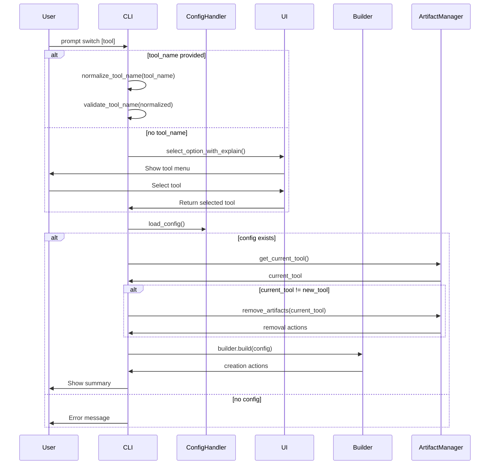
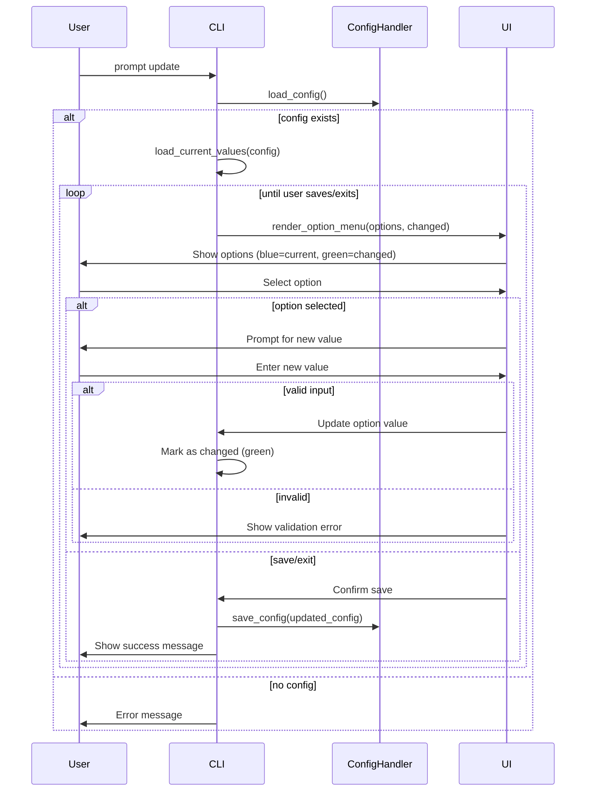

# Architecture Requirements Document: CLI Switch and Update Commands

**Document Version:** 1.0  
**Date:** 2026-03-06  
**Status:** Draft  
**Author:** AI Assistant  

---

## 1. Executive Summary

This ARD provides technical architecture and implementation guidance for two new CLI commands:

1. **`switch` command** - Switch between AI assistant tools with artifact management
2. **`update` command** - Interactive configuration update with visual feedback

---

## 2. Architecture Overview

### 2.1 High-Level Design

```mermaid
graph TB
    subgraph CLI
        CLI[promptosaurus/cli.py]
    end
    
    subgraph Commands
        SWITCH[switch command]
        UPDATE[update command]
    end
    
    subgraph Core
        CFG[config_handler.py]
        REG[registry.py]
    end
    
    subgraph UI
        SEL[ui/_selector.py]
    end
    
    subgraph Builders
        KB[kilo_cli.py]
        KI[kilo_ide.py]
        CL[cline.py]
        CU[cursor.py]
        CO[copilot.py]
    end
    
    CLI --> SWITCH
    CLI --> UPDATE
    SWITCH --> CFG
    SWITCH --> SEL
    SWITCH --> KB
    SWITCH --> KI
    SWITCH --> CL
    SWITCH --> CU
    SWITCH --> CO
    UPDATE --> CFG
    UPDATE --> SEL
    UPDATE --> REG
```

### 2.2 Key Components

| Component | Responsibility |
|-----------|----------------|
| `promptosaurus/cli.py` | CLI entry point, add new `@cli.command` decorators |
| `promptosaurus/config_handler.py` | Load/save YAML configuration |
| `promptosaurus/builders/*` | Generate AI tool artifacts |
| `promptosaurus/ui/_selector.py` | Interactive selection menus |
| `promptosaurus/registry.py` | Mode and file registration |

---

## 3. Feature 1: switch Command

### 3.1 Command Interface

```python
@cli.command("switch")
@click.argument("tool_name", required=False)
def switch_command(tool_name: str | None):
    """Switch to a different AI assistant tool.
    
    Usage:
        prompt switch kilo-ide    # Switch directly
        prompt switch             # Interactive menu
    """
```

### 3.2 Normalization Module

Create `promptosaurus/cli_utils.py`:

```python
import re

SUPPORTED_TOOLS = {"kilo-cli", "kilo-ide", "cline", "cursor", "copilot"}

def normalize_tool_name(input_name: str) -> str:
    """Normalize tool name: remove special chars, lowercase."""
    # Remove all non-alphanumeric characters
    normalized = re.sub(r"[^a-zA-Z0-9]", "", input_name)
    # Convert to lowercase
    normalized = normalized.lower()
    # Handle specific mappings
    tool_mappings = {
        "kilocli": "kilo-cli",
        "kiloide": "kilo-ide",
        "cline": "cline",
        "cursor": "cursor",
        "copilot": "copilot",
    }
    return tool_mappings.get(normalized, normalized)

def validate_tool_name(tool_name: str) -> bool:
    """Check if tool name is supported."""
    return tool_name in SUPPORTED_TOOLS
```

### 3.3 Artifact Management

Create `promptosaurus/artifacts.py`:

```python
from pathlib import Path
from typing import Set

ARTIFACT_FILES: dict[str, dict[str, Set[str]]] = {
    "kilo-cli": {
        "create": {".opencode/"},
        "remove": {".kilocode/", ".clinerules", ".cursor/", ".cursorrules", 
                   ".github/copilot-instructions.md"},
    },
    "kilo-ide": {
        "create": {".kilocode/"},
        "remove": {".opencode/", ".clinerules", ".cursor/", ".cursorrules",
                   ".github/copilot-instructions.md"},
    },
    "cline": {
        "create": {".clinerules"},
        "remove": {".opencode/", ".kilocode/", ".cursor/", ".cursorrules",
                   ".github/copilot-instructions.md"},
    },
    "cursor": {
        "create": {".cursor/", ".cursorrules"},
        "remove": {".opencode/", ".kilocode/", ".clinerules",
                   ".github/copilot-instructions.md"},
    },
    "copilot": {
        "create": {".github/copilot-instructions.md"},
        "remove": {".opencode/", ".kilocode/", ".clinerules", ".cursor/", ".cursorrules"},
    },
}

class ArtifactManager:
    """Manage AI tool artifact creation and removal."""
    
    def __init__(self, base_path: Path = Path(".")):
        self.base_path = base_path
    
    def remove_artifacts(self, tool: str) -> list[str]:
        """Remove artifacts for a specific tool."""
        to_remove = ARTIFACT_FILES[tool]["remove"]
        actions = []
        for artifact in to_remove:
            path = self.base_path / artifact
            if path.exists():
                if path.is_dir():
                    import shutil
                    shutil.rmtree(path)
                    actions.append(f"Removed directory: {artifact}")
                else:
                    path.unlink()
                    actions.append(f"Removed file: {artifact}")
        return actions
    
    def get_current_tool(self) -> str | None:
        """Detect currently configured AI tool by checking which artifacts exist."""
        for tool, files in ARTIFACT_FILES.items():
            # Check if any of this tool's unique files exist
            for artifact in files["create"]:
                if (self.base_path / artifact).exists():
                    return tool
        return None
```

### 3.4 Switch Flow



### 3.5 Files to Modify/Create

| File | Change Type | Description |
|------|-------------|-------------|
| `promptosaurus/cli.py` | Modify | Add `@cli.command("switch")` |
| `promptosaurus/cli_utils.py` | Create | Tool name normalization |
| `promptosaurus/artifacts.py` | Create | Artifact management |

---

## 4. Feature 2: update Command

### 4.1 Command Interface

```python
@cli.command("update")
def update_command():
    """Update configuration options interactively.
    
    Usage:
        prompt update
    """
```

### 4.2 Configuration Options Definition

Create `promptosaurus/config_options.py`:

```python
from dataclasses import dataclass
from typing import Any, Callable

@dataclass
class ConfigOption:
    key: str
    display_name: str
    option_type: str  # "single-select", "text", "composite"
    current_value: Any
    available_options: list[str] | None = None
    validator: Callable[[str], bool] | None = None

# Define all updateable options (excluding AI tool)
CONFIG_OPTIONS: list[ConfigOption] = [
    ConfigOption(
        key="repository.type",
        display_name="Repository Type",
        option_type="single-select",
        current_value=None,  # Loaded at runtime
        available_options=["single-language", "multi-language-monorepo", "mixed-collocation"],
    ),
    ConfigOption(
        key="spec.language",
        display_name="Language",
        option_type="single-select",
        current_value=None,
        available_options=["python", "typescript", "javascript", "go", "java", 
                         "rust", "csharp", "ruby", "php", "swift", "kotlin"],
    ),
    ConfigOption(
        key="spec.runtime",
        display_name="Runtime",
        option_type="text",
        current_value=None,
    ),
    ConfigOption(
        key="spec.package_manager",
        display_name="Package Manager",
        option_type="single-select",
        current_value=None,
        available_options=["poetry", "npm", "pip", "yarn", "pnpm", "bun", 
                         "cargo", "gradle", "maven", "dotnet"],
    ),
    ConfigOption(
        key="spec.test_framework",
        display_name="Test Framework",
        option_type="single-select",
        current_value=None,
        available_options=["pytest", "vitest", "jest", "go test", "junit", 
                         "rspec", "phpunit", "swift testing", "kotest"],
    ),
    ConfigOption(
        key="spec.linter",
        display_name="Linter",
        option_type="single-select",
        current_value=None,
        available_options=["ruff", "eslint", "pylint", "golangci-lint", 
                         "checkstyle", "rubocop", "phpcs"],
    ),
    ConfigOption(
        key="spec.formatter",
        display_name="Formatter",
        option_type="single-select",
        current_value=None,
        available_options=["ruff", "prettier", "black", "gofmt", 
                         "dotnet format", "rubocop"],
    ),
    ConfigOption(
        key="spec.coverage",
        display_name="Coverage Targets",
        option_type="composite",
        current_value=None,
    ),
]

def load_current_values(config: dict[str, Any]) -> list[ConfigOption]:
    """Load current values from config into ConfigOption objects."""
    options = []
    for opt in CONFIG_OPTIONS:
        # Get value from nested config using dot notation
        value = config
        for key in opt.key.split("."):
            value = value.get(key, {})
        opt.current_value = value
        options.append(opt)
    return options
```

### 4.3 Update Flow



### 4.4 Color Implementation

```python
import click

def render_option_line(option: ConfigOption, is_changed: bool) -> str:
    """Render an option line with appropriate color."""
    value_str = str(option.current_value) if option.current_value else "[not set]"
    
    if is_changed:
        value_display = click.style(f"[{value_str}]", fg="green")
    else:
        value_display = click.style(f"[{value_str}]", fg="blue")
    
    return f"  {option.display_name:20} {value_display}"

def render_menu(options: list[ConfigOption], changed_keys: set[str]) -> None:
    """Render the update menu with colors."""
    click.echo("\n" + "=" * 60)
    click.secho("  Prompt CLI - Update Configuration", bold=True, fg="cyan")
    click.echo("=" * 60)
    click.echo("\nUse ↑/↓ arrows to navigate, Enter to modify.")
    click.echo("Current values shown in blue, changes in green.\n")
    
    for i, opt in enumerate(options):
        is_changed = opt.key in changed_keys
        line = render_option_line(opt, is_changed)
        click.echo(line)
    
    click.echo("\n" + "=" * 60)
```

### 4.5 Files to Modify/Create

| File | Change Type | Description |
|------|-------------|-------------|
| `promptosaurus/cli.py` | Modify | Add `@cli.command("update")` |
| `promptosaurus/config_options.py` | Create | Configuration option definitions |

---

## 5. Implementation Phases

### Phase 1: Shared Utilities (Low Risk)
- **Effort:** 1-2 hours
- **Files:** `cli_utils.py`, `artifacts.py`, `config_options.py`
- **Risk:** Minimal - utility functions only
- **Order:** Start here

### Phase 2: switch Command (Medium Risk)
- **Effort:** 2-3 hours
- **Files:** `cli.py` (switch command), integration with builders
- **Risk:** File deletion could cause data loss
- **Order:** Implement after Phase 1
- **Strategy:** Test artifact removal carefully

### Phase 3: update Command (Medium Risk)
- **Effort:** 3-4 hours
- **Files:** `cli.py` (update command), UI rendering
- **Risk:** Config corruption possible
- **Order:** Implement after Phase 2
- **Strategy:** Use atomic writes for config

---

## 6. Error Handling

| Scenario | Handling |
|----------|-----------|
| No config exists | Show error: "No configuration found. Run 'prompt init' first." |
| Invalid tool name | Show error: "Invalid tool 'X'. Supported tools: ..." |
| Artifact removal fails | Log warning, continue with switch |
| Config save fails | Show error, preserve in-memory state |
| Builder fails | Show error with builder message |

---

## 7. Testing Strategy

### Unit Tests
- `test_normalize_tool_name()` - All normalization cases
- `test_validate_tool_name()` - Valid/invalid tools
- `test_artifact_manager()` - Creation/removal detection
- `test_config_options_loading()` - Value extraction

### Integration Tests
- Full `switch` flow with mock config
- Full `update` flow with mock config
- Error scenarios

### Edge Cases
- Config file corrupted
- Partial artifact removal
- Concurrent modifications

---

## 8. Security Considerations

| Risk | Mitigation |
|------|------------|
| Path traversal in artifact removal | Use fixed paths, validate all deletions |
| Config injection | Validate all inputs before saving |
| Accidental file deletion | Confirm before delete, use safe patterns |

---

## 9. Files Summary

| File | Change Type | Lines (est.) |
|------|-------------|--------------|
| `promptosaurus/cli.py` | Modify | +150 |
| `promptosaurus/cli_utils.py` | Create | ~50 |
| `promptosaurus/artifacts.py` | Create | ~80 |
| `promptosaurus/config_options.py` | Create | ~100 |

---

## 10. Related Documents

- [PRD: CLI Switch and Update Commands](docs/prd/cli-switch-update-commands.md)
- [`promptosaurus/cli.py`](promptosaurus/cli.py:1)
- [`promptosaurus/config_handler.py`](promptosaurus/config_handler.py:1)
- [`promptosaurus/builders/`](promptosaurus/builders/)
