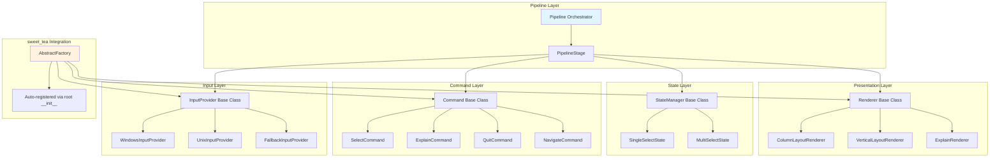

# UI Architecture Redesign: Antifragile Pipeline-Based System

## Executive Summary

The current [`ui.py`](promptcli/ui.py:1) is fragile due to:
- **Single Responsibility Violation**: One function handles display, input, platform detection, and state management
- **Extensive Branching**: Platform-specific code (`if os.name == "nt"`) embedded throughout
- **Zero Extension Points**: Adding features requires modifying core logic
- **No Abstraction Layers**: Tight coupling between rendering, input handling, and business logic

This redesign transforms the UI into an **antifragile pipeline system** that:
- **Gains from disorder**: New input methods, display modes, or interactions add value without breaking existing code
- **Is SOLID**: Clear separation of concerns with dependency inversion
- **Uses sweet_tea**: Factory-based component instantiation with type-safe registries
- **Minimizes branching**: Strategy pattern replaces conditional logic

---

## Core Architectural Principles

### 1. Pipeline Pattern
Each user interaction flows through a typed pipeline:
```
Input Event → Command → State Update → Render
```

### 2. Strategy Pattern for Platform Abstraction
Platform-specific concerns are encapsulated in swappable strategies.

### 3. Command Pattern for User Actions
Every user action (key press, selection, explain) is a command object.

### 4. Factory Pattern via sweet_tea
Components are instantiated through type-safe factories, enabling runtime extensibility. sweet_tea auto-registers all classes from the root `__init__.py`.

### 5. Inversion of Control
The UI framework calls user code via callbacks, not the reverse.

---

## Architecture Diagram



---

## Layer-by-Layer Design

### 1. Domain Models (Pydantic BaseModel)

```python
from enum import Enum, auto
from pydantic import BaseModel, Field


class InputEventType(Enum):
    """Types of input events - extensible without code changes."""
    NUMBER = auto()
    UP = auto()
    DOWN = auto()
    ENTER = auto()
    QUIT = auto()
    UNKNOWN = auto()


class InputEvent(BaseModel):
    """Immutable input event - all context included."""
    event_type: InputEventType
    value: int | None = None  # For NUMBER events
    raw_key: str | bytes = ""

    class Config:
        frozen = True


class QuestionContext(BaseModel):
    """Context for a question - passed through pipeline."""
    question: str
    options: list[str]
    explanations: dict[str, str]
    question_explanation: str
    default_index: int = 0
    allow_multiple: bool = False

    class Config:
        frozen = True
```

### 2. State Layer (Base Classes with NotImplementedError)

```python
from typing import Set
from pydantic import BaseModel


class SelectionState:
    """Base class for selection state - Strategy pattern.
    
    Subclasses must override all methods.
    """

    @property
    def current_selection(self) -> int | Set[int]:
        """Get current selection(s)."""
        raise NotImplementedError(f"{self.__class__.__name__} must implement current_selection")

    def select(self, index: int) -> "SelectionState":
        """Return new state after selection - immutable."""
        raise NotImplementedError(f"{self.__class__.__name__} must implement select")

    def navigate(self, direction: int) -> "SelectionState":
        """Return new state after navigation."""
        raise NotImplementedError(f"{self.__class__.__name__} must implement navigate")

    def is_selected(self, index: int) -> bool:
        """Check if index is selected."""
        raise NotImplementedError(f"{self.__class__.__name__} must implement is_selected")


class SingleSelectState(SelectionState):
    """Single selection state - immutable."""

    def __init__(self, selected: int, max_index: int):
        self._selected = selected
        self._max = max_index

    @property
    def current_selection(self) -> int:
        return self._selected

    def select(self, index: int) -> "SingleSelectState":
        if 0 <= index <= self._max:
            return SingleSelectState(index, self._max)
        return self

    def navigate(self, direction: int) -> "SingleSelectState":
        new_index = max(0, min(self._max, self._selected + direction))
        return SingleSelectState(new_index, self._max)

    def is_selected(self, index: int) -> bool:
        return index == self._selected


class MultiSelectState(SelectionState):
    """Multi-selection state - immutable."""

    def __init__(self, selected: Set[int], max_index: int):
        self._selected = frozenset(selected)
        self._max = max_index

    @property
    def current_selection(self) -> Set[int]:
        return set(self._selected)

    def select(self, index: int) -> "MultiSelectState":
        if index > self._max:
            return self
        new_selected = set(self._selected)
        if index in new_selected:
            new_selected.remove(index)
        else:
            new_selected.add(index)
        return MultiSelectState(new_selected, self._max)

    def navigate(self, direction: int) -> "MultiSelectState":
        # Multi-select doesn't use navigation
        return self

    def is_selected(self, index: int) -> bool:
        return index in self._selected
```

### 3. Input Layer (Strategy Pattern)

```python
from typing import Iterator


class InputProvider:
    """Base class for input provider - Strategy pattern for platform abstraction.
    
    Subclasses must override all methods.
    """

    def get_events(self) -> Iterator[InputEvent]:
        """Yield input events - generator for continuous input."""
        raise NotImplementedError(f"{self.__class__.__name__} must implement get_events")

    def supports_raw(self) -> bool:
        """Whether this provider supports raw key input."""
        raise NotImplementedError(f"{self.__class__.__name__} must implement supports_raw")


class WindowsInputProvider(InputProvider):
    """Windows-specific input using msvcrt."""

    def get_events(self) -> Iterator[InputEvent]:
        import msvcrt

        while True:
            key = msvcrt.getch()
            yield self._parse_key(key, msvcrt)

    def _parse_key(self, key: bytes, msvcrt) -> InputEvent:
        """Parse Windows key codes into events."""
        if key == b"\r":
            return InputEvent(event_type=InputEventType.ENTER)
        elif key == b"q":
            return InputEvent(event_type=InputEventType.QUIT)
        elif key == b"\xe0":  # Arrow key prefix
            arrow = msvcrt.getch()
            if arrow == b"H":
                return InputEvent(event_type=InputEventType.UP)
            elif arrow == b"P":
                return InputEvent(event_type=InputEventType.DOWN)
        elif key.isdigit():
            return InputEvent(event_type=InputEventType.NUMBER, value=int(key.decode()))

        return InputEvent(event_type=InputEventType.UNKNOWN, raw_key=key)

    def supports_raw(self) -> bool:
        return True


class UnixInputProvider(InputProvider):
    """Unix-specific input using termios/tty."""

    def get_events(self) -> Iterator[InputEvent]:
        import sys
        import termios
        import tty

        fd = sys.stdin.fileno()
        old_settings = termios.tcgetattr(fd)

        try:
            tty.setraw(fd)
            while True:
                key = sys.stdin.read(1)
                yield self._parse_key(key, sys.stdin)
        finally:
            termios.tcsetattr(fd, termios.TCSADRAIN, old_settings)

    def _parse_key(self, key: str, stdin) -> InputEvent:
        """Parse Unix key codes into events."""
        if key == "\r":
            return InputEvent(event_type=InputEventType.ENTER)
        elif key == "q":
            return InputEvent(event_type=InputEventType.QUIT)
        elif key == "\x1b":  # Escape sequence
            seq = stdin.read(2)
            if seq == "[A":
                return InputEvent(event_type=InputEventType.UP)
            elif seq == "[B":
                return InputEvent(event_type=InputEventType.DOWN)
        elif key.isdigit():
            return InputEvent(event_type=InputEventType.NUMBER, value=int(key))

        return InputEvent(event_type=InputEventType.UNKNOWN, raw_key=key)

    def supports_raw(self) -> bool:
        return True


class FallbackInputProvider(InputProvider):
    """Fallback using standard input - no raw mode."""

    def get_events(self) -> Iterator[InputEvent]:
        user_input = input("Enter number(s), comma-separated: ").strip()

        # Parse comma-separated numbers
        try:
            numbers = [int(x.strip()) for x in user_input.split(",")]
            for num in numbers:
                yield InputEvent(event_type=InputEventType.NUMBER, value=num)
        except ValueError:
            pass

        yield InputEvent(event_type=InputEventType.ENTER)

    def supports_raw(self) -> bool:
        return False
```

### 4. Command Layer (Command Pattern)

```python
from typing import TYPE_CHECKING

if TYPE_CHECKING:
    from pipeline import PipelineContext


class Command:
    """Base class for commands - Command pattern.
    
    Subclasses must override execute.
    """

    def execute(self, context: "PipelineContext") -> "CommandResult":
        """Execute command within pipeline context."""
        raise NotImplementedError(f"{self.__class__.__name__} must implement execute")


class CommandResult:
    """Result of command execution."""

    def __init__(
        self,
        continue_pipeline: bool = True,
        new_state: SelectionState | None = None,
        output_value: str | list[str] | None = None,
        transition_to: str | None = None,
    ):
        self.continue_pipeline = continue_pipeline
        self.new_state = new_state
        self.output_value = output_value
        self.transition_to = transition_to  # For state machine transitions


class SelectCommand(Command):
    """Command to select an option by number."""

    def __init__(self, number: int):
        self.number = number

    def execute(self, context: "PipelineContext") -> CommandResult:
        # Convert 1-based to 0-based
        index = self.number - 1
        new_state = context.state.select(index)

        return CommandResult(
            continue_pipeline=True,
            new_state=new_state,
        )


class NavigateCommand(Command):
    """Command to navigate up/down."""

    def __init__(self, direction: int):
        self.direction = direction  # -1 for up, +1 for down

    def execute(self, context: "PipelineContext") -> CommandResult:
        new_state = context.state.navigate(self.direction)
        return CommandResult(
            continue_pipeline=True,
            new_state=new_state,
        )


class ConfirmCommand(Command):
    """Command to confirm selection."""

    def execute(self, context: "PipelineContext") -> CommandResult:
        selection = context.state.current_selection

        # Handle explain option
        explain_index = len(context.question.options)
        if isinstance(selection, int):
            if selection == explain_index:
                return CommandResult(
                    continue_pipeline=True,
                    transition_to="explain",
                )
            return CommandResult(
                continue_pipeline=False,
                output_value=context.question.options[selection],
            )
        else:  # Multi-select
            if explain_index in selection:
                selection = {s for s in selection if s != explain_index}
                return CommandResult(
                    continue_pipeline=True,
                    new_state=MultiSelectState(selection, len(context.question.options)),
                    transition_to="explain",
                )
            return CommandResult(
                continue_pipeline=False,
                output_value=[context.question.options[i] for i in sorted(selection)],
            )


class QuitCommand(Command):
    """Command to quit with defaults."""

    def execute(self, context: "PipelineContext") -> CommandResult:
        default = context.question.options[context.question.default_index]

        if context.question.allow_multiple:
            return CommandResult(
                continue_pipeline=False,
                output_value=[default],
            )
        return CommandResult(
            continue_pipeline=False,
            output_value=default,
        )


class EnterExplainCommand(Command):
    """Command to enter explain mode."""

    def execute(self, context: "PipelineContext") -> CommandResult:
        return CommandResult(
            continue_pipeline=True,
            transition_to="explain",
        )


class NoOpCommand(Command):
    """No-op command for unknown inputs."""

    def execute(self, context: "PipelineContext") -> CommandResult:
        return CommandResult(continue_pipeline=True)
```

### 5. Presentation Layer (Strategy Pattern)

```python
class Renderer:
    """Base class for renderer - Strategy pattern for display.
    
    Subclasses must override render.
    """

    def render(self, context: "PipelineContext") -> str:
        """Render current state to string."""
        raise NotImplementedError(f"{self.__class__.__name__} must implement render")


class ColumnLayoutRenderer(Renderer):
    """Renders options in columns."""

    def __init__(self, items_per_column: int = 8, column_width: int = 20):
        self.items_per_column = items_per_column
        self.column_width = column_width

    def render(self, context: "PipelineContext") -> str:
        options = context.display_options
        lines = []

        num_items = len(options)
        num_columns = (num_items + self.items_per_column - 1) // self.items_per_column

        for row in range(self.items_per_column):
            line_parts = []
            for col in range(num_columns):
                idx = col * self.items_per_column + row
                if idx < num_items:
                    num_str = f"{idx + 1}."
                    content = f"{num_str:>3} {options[idx]}"
                    part = content.ljust(self.column_width)
                    line_parts.append(part)
            if line_parts:
                lines.append("".join(line_parts))

        return "\n".join(lines)


class VerticalLayoutRenderer(Renderer):
    """Renders options in vertical list."""

    def render(self, context: "PipelineContext") -> str:
        options = context.display_options
        lines = []
        state = context.state
        question = context.question

        for i, opt in enumerate(options):
            num = f"{i + 1}."
            default_tag = " (default)" if i == question.default_index else ""

            if question.allow_multiple:
                marker = "[*]" if state.is_selected(i) else "[ ]"
            else:
                marker = "→" if state.is_selected(i) else " "

            if state.is_selected(i) or (not question.allow_multiple and opt == "Explain"):
                exp = context.get_explanation(opt)
                if exp:
                    lines.append(f"  {marker} {num} {opt}{default_tag}")
                    lines.append(f"       └─ {exp}")
                else:
                    lines.append(f"  {marker} {num} {opt}{default_tag}")
            else:
                lines.append(f"  {marker} {num} {opt}")

        return "\n".join(lines)


class ExplainRenderer(Renderer):
    """Renders explain mode."""

    def render(self, context: "PipelineContext") -> str:
        lines = [
            f"\n{context.question.question}\n",
            "=" * len(context.question.question),
            f"\n{context.question.question_explanation}\n",
            "Available options:\n",
        ]

        for opt in context.question.options:
            lines.append(f"  • {opt}")
            exp = context.question.explanations.get(opt, "")
            if exp:
                lines.append(f"    {exp}")
            lines.append("")

        lines.append("\nPress any key to return...")
        return "\n".join(lines)
```

### 6. Pipeline Orchestration Layer

```python
from typing import Callable
from pydantic import BaseModel


class PipelineContext(BaseModel):
    """Context passed through pipeline stages."""

    question: QuestionContext
    state: SelectionState
    mode: str = "select"  # "select" or "explain"

    class Config:
        frozen = True

    @property
    def display_options(self) -> list[str]:
        """Get options to display (includes Explain)."""
        opts = list(self.question.options)
        if "Explain" not in opts:
            opts.append("Explain")
        return opts

    def get_explanation(self, option: str) -> str:
        """Get explanation for option."""
        if option == "Explain":
            return "Learn more about this question"
        return self.question.explanations.get(option, "")


class PipelineStage:
    """Base class for pipeline stage."""

    def process(self, context: PipelineContext) -> PipelineContext:
        """Process context and return potentially modified context."""
        raise NotImplementedError(f"{self.__class__.__name__} must implement process")


class StateUpdateStage:
    """Applies command to update state."""

    def apply(self, command: Command, context: PipelineContext) -> CommandResult:
        return command.execute(context)


class RenderStage:
    """Renders current state."""

    def __init__(self, renderer_selector: Callable[[PipelineContext], Renderer]):
        self.renderer_selector = renderer_selector

    def render(self, context: PipelineContext) -> None:
        # Clear screen
        print("\033[2J\033[H", end="")

        renderer = self.renderer_selector(context)
        output = renderer.render(context)
        print(output)

        if context.mode == "select":
            print("\nControls: Numbers to select, Enter to confirm, q to quit")


class PipelineOrchestrator:
    """Orchestrates the complete pipeline."""

    def __init__(
        self,
        input_provider: InputProvider,
        render_stage: RenderStage,
        state_update_stage: StateUpdateStage,
    ):
        self.input_provider = input_provider
        self.render_stage = render_stage
        self.state_update_stage = state_update_stage

    def run(self, question: QuestionContext) -> str | list[str]:
        """Run the complete pipeline for a question."""
        # Initialize state based on question type
        if question.allow_multiple:
            initial_state = MultiSelectState({question.default_index}, len(question.options))
        else:
            initial_state = SingleSelectState(question.default_index, len(question.options))

        context = PipelineContext(
            question=question,
            state=initial_state,
            mode="select",
        )

        # Create event generator
        events = self.input_provider.get_events()

        while True:
            # Render current state
            self.render_stage.render(context)

            # Get next event and convert to command
            event = next(events)
            command = self._create_command(event)

            # Execute command
            result = self.state_update_stage.apply(command, context)

            # Handle transitions
            if result.transition_to:
                context = PipelineContext(
                    question=context.question,
                    state=context.state,
                    mode=result.transition_to,
                )
                if result.transition_to == "explain":
                    self._handle_explain_mode(context, events)
                    context = PipelineContext(
                        question=context.question,
                        state=result.new_state or context.state,
                        mode="select",
                    )
                continue

            # Update state
            if result.new_state:
                context = PipelineContext(
                    question=context.question,
                    state=result.new_state,
                    mode=context.mode,
                )

            # Check for completion
            if not result.continue_pipeline:
                return result.output_value

    def _create_command(self, event: InputEvent) -> Command:
        """Factory method to create commands from events."""
        match event.event_type:
            case InputEventType.NUMBER if event.value is not None:
                return SelectCommand(event.value)
            case InputEventType.UP:
                return NavigateCommand(-1)
            case InputEventType.DOWN:
                return NavigateCommand(1)
            case InputEventType.ENTER:
                return ConfirmCommand()
            case InputEventType.QUIT:
                return QuitCommand()
            case _:
                # Unknown events are no-ops
                return NoOpCommand()

    def _handle_explain_mode(self, context: PipelineContext, events) -> None:
        """Handle explain mode - wait for any key."""
        self.render_stage.render(context)
        next(events)  # Wait for any key
```

---

## sweet_tea Integration

sweet_tea auto-registers all classes from the package root `__init__.py`. No separate registry file is needed.

```python
# promptcli/__init__.py - sweet_tea auto-registers all classes here
from promptcli.ui.domain.events import InputEvent, InputEventType
from promptcli.ui.domain.context import QuestionContext, PipelineContext
from promptcli.ui.state.single import SingleSelectState
from promptcli.ui.state.multi import MultiSelectState
from promptcli.ui.input.windows import WindowsInputProvider
from promptcli.ui.input.unix import UnixInputProvider
from promptcli.ui.input.fallback import FallbackInputProvider
from promptcli.ui.render.columns import ColumnLayoutRenderer
from promptcli.ui.render.vertical import VerticalLayoutRenderer
from promptcli.ui.render.explain import ExplainRenderer
from promptcli.ui.commands.select import SelectCommand
from promptcli.ui.commands.navigate import NavigateCommand
from promptcli.ui.commands.confirm import ConfirmCommand
from promptcli.ui.commands.quit import QuitCommand
from promptcli.ui.pipeline.orchestrator import PipelineOrchestrator

# sweet_tea automatically registers all imported classes
```

```python
# UIFactory for creating components
from sweet_tea.abstract_factory import AbstractFactory
import os


class UIFactory:
    """Factory for creating UI components via sweet_tea."""

    @staticmethod
    def create_input_provider() -> InputProvider:
        """Create appropriate input provider for current platform."""
        factory = AbstractFactory[InputProvider]

        try:
            if os.name == "nt":
                return factory.create("windows_input")
            else:
                return factory.create("unix_input")
        except Exception:
            return factory.create("fallback_input")

    @staticmethod
    def create_renderer(context: PipelineContext) -> Renderer:
        """Create appropriate renderer based on context."""
        factory = AbstractFactory[Renderer]

        if context.mode == "explain":
            return factory.create("explain_renderer")

        # Choose layout based on option count
        if len(context.display_options) > 8:
            return factory.create("column_layout")
        return factory.create("vertical_layout")
```

---

## Usage: The New Public API

```python
# promptcli/ui/_selector.py - Main implementation

from typing import TypeVar, ParamSpec
from functools import wraps

from promptcli.ui.domain.context import QuestionContext
from promptcli.ui.pipeline.orchestrator import PipelineOrchestrator
from promptcli.ui._factory import UIFactory

T = TypeVar("T")
P = ParamSpec("P")


def select_option_with_explain(
    question: str,
    options: list[str],
    explanations: dict[str, str],
    question_explanation: str,
    default_index: int = 0,
    allow_multiple: bool = False,
) -> str | list[str]:
    """
    Interactive selection with number keys and explain option.

    This is the main entry point - the pipeline orchestrates everything.
    """
    # Build question context
    context = QuestionContext(
        question=question,
        options=options,
        explanations=explanations,
        question_explanation=question_explanation,
        default_index=default_index,
        allow_multiple=allow_multiple,
    )

    # Create components via sweet_tea factories
    input_provider = UIFactory.create_input_provider()
    render_stage = RenderStage(renderer_selector=UIFactory.create_renderer)
    state_update = StateUpdateStage()

    # Create and run pipeline
    pipeline = PipelineOrchestrator(
        input_provider=input_provider,
        render_stage=render_stage,
        state_update_stage=state_update,
    )

    return pipeline.run(context)
```

---

## Extension Points (Antifragility in Action)

### Adding a New Input Method

```python
# 1. Create new provider in promptcli/ui/input/websocket.py
class WebSocketInputProvider(InputProvider):
    """Input from WebSocket - for web UI."""
    def get_events(self) -> Iterator[InputEvent]:
        # WebSocket implementation
        pass
    
    def supports_raw(self) -> bool:
        return True

# 2. Import in promptcli/__init__.py for auto-registration
from promptcli.ui.input.websocket import WebSocketInputProvider

# 3. Use via factory
input_provider = AbstractFactory[InputProvider].create("websocket_input")
```

### Adding a New Layout

```python
# 1. Create new renderer in promptcli/ui/render/grid.py
class GridLayoutRenderer(Renderer):
    """Grid layout for many options."""
    def render(self, context: PipelineContext) -> str:
        # Grid implementation
        pass

# 2. Import in promptcli/__init__.py for auto-registration  
from promptcli.ui.render.grid import GridLayoutRenderer

# 3. Use via factory
renderer = AbstractFactory[Renderer].create("grid_layout")
```

### Adding Custom Commands

```python
# 1. Create command in promptcli/ui/commands/search.py
class SearchCommand(Command):
    """Filter options by typing."""
    def execute(self, context: PipelineContext) -> CommandResult:
        # Search implementation
        pass

# 2. Extend command factory in orchestrator
class ExtendedCommandFactory(CommandFactory):
    def create_command(self, event: InputEvent) -> Command:
        if event.event_type == InputEventType.CHAR:  # New event type
            return SearchCommand(event.value)
        return super().create_command(event)
```

---

## SOLID Compliance Analysis

| Principle | Current ui.py | New Design |
|-----------|--------------|------------|
| **Single Responsibility** | ❌ One function does everything | ✅ Each class has one reason to change |
| **Open/Closed** | ❌ Modify to extend | ✅ Extend via new classes + auto-registration |
| **Liskov Substitution** | ❌ No inheritance | ✅ All strategies interchangeable |
| **Interface Segregation** | ❌ No interfaces | ✅ Small, focused base classes |
| **Dependency Inversion** | ❌ Depends on msvcrt/termios directly | ✅ Depends on InputProvider abstraction |

---

## Testing Strategy (unittest)

```python
# tests/unit/ui/test_state.py
import unittest
from promptcli.ui.state.single import SingleSelectState
from promptcli.ui.state.multi import MultiSelectState


class TestSingleSelectState(unittest.TestCase):
    """Single selection state machine tests."""

    def test_initial_selection(self):
        state = SingleSelectState(0, 5)
        self.assertEqual(state.current_selection, 0)

    def test_select_valid_index(self):
        state = SingleSelectState(0, 5)
        new_state = state.select(3)
        self.assertEqual(new_state.current_selection, 3)
        self.assertEqual(state.current_selection, 0)  # Original unchanged

    def test_select_out_of_bounds(self):
        state = SingleSelectState(2, 5)
        new_state = state.select(10)
        self.assertEqual(new_state.current_selection, 2)  # Unchanged

    def test_navigate_up(self):
        state = SingleSelectState(2, 5)
        new_state = state.navigate(-1)
        self.assertEqual(new_state.current_selection, 1)

    def test_navigate_up_at_boundary(self):
        state = SingleSelectState(0, 5)
        new_state = state.navigate(-1)
        self.assertEqual(new_state.current_selection, 0)  # Stays at boundary

    def test_navigate_down(self):
        state = SingleSelectState(2, 5)
        new_state = state.navigate(1)
        self.assertEqual(new_state.current_selection, 3)

    def test_navigate_down_at_boundary(self):
        state = SingleSelectState(4, 5)
        new_state = state.navigate(1)
        self.assertEqual(new_state.current_selection, 4)  # Stays at boundary


class TestMultiSelectState(unittest.TestCase):
    """Multi-selection state machine tests."""

    def test_initial_selection(self):
        state = MultiSelectState({0, 2}, 5)
        self.assertEqual(state.current_selection, {0, 2})

    def test_toggle_add(self):
        state = MultiSelectState({0}, 5)
        new_state = state.select(2)
        self.assertTrue(new_state.is_selected(0))
        self.assertTrue(new_state.is_selected(2))

    def test_toggle_remove(self):
        state = MultiSelectState({0, 2}, 5)
        new_state = state.select(2)
        self.assertTrue(new_state.is_selected(0))
        self.assertFalse(new_state.is_selected(2))

    def test_navigate_noop(self):
        """Multi-select doesn't use navigation."""
        state = MultiSelectState({0}, 5)
        new_state = state.navigate(1)
        self.assertEqual(new_state.current_selection, {0})


if __name__ == "__main__":
    unittest.main()
```

---

## Migration Path

### Phase 1: Parallel Implementation
- Create new `ui/` package alongside existing `ui.py`
- Implement core pipeline components

### Phase 2: Feature Flag
- Add `USE_NEW_UI=1` environment variable
- Gradually migrate calls in [`cli.py`](promptcli/cli.py:1)

### Phase 3: Full Migration
- Remove old `ui.py`
- Rename `ui/` to `ui.py` or keep as package

### Phase 4: Extensions
- Add WebSocket input for web UI
- Add custom layouts per question type
- Add search/filter commands

---

## Summary

This redesign transforms a fragile, 350-line function into a **composable, testable, extensible pipeline system**:

1. **No branching on platform**: Strategy pattern encapsulates Windows/Unix differences
2. **No branching on display mode**: Different renderers for different contexts
3. **Immutable state**: State transitions create new objects, preventing bugs
4. **Type-safe factories**: sweet_tea auto-registers classes from root `__init__.py`
5. **Pure functions**: Rendering is deterministic and testable
6. **Extensible without modification**: New features via new classes, not code changes

The result is a system that **improves with stress**—adding new platforms, input methods, or display modes strengthens the architecture rather than weakening it.
