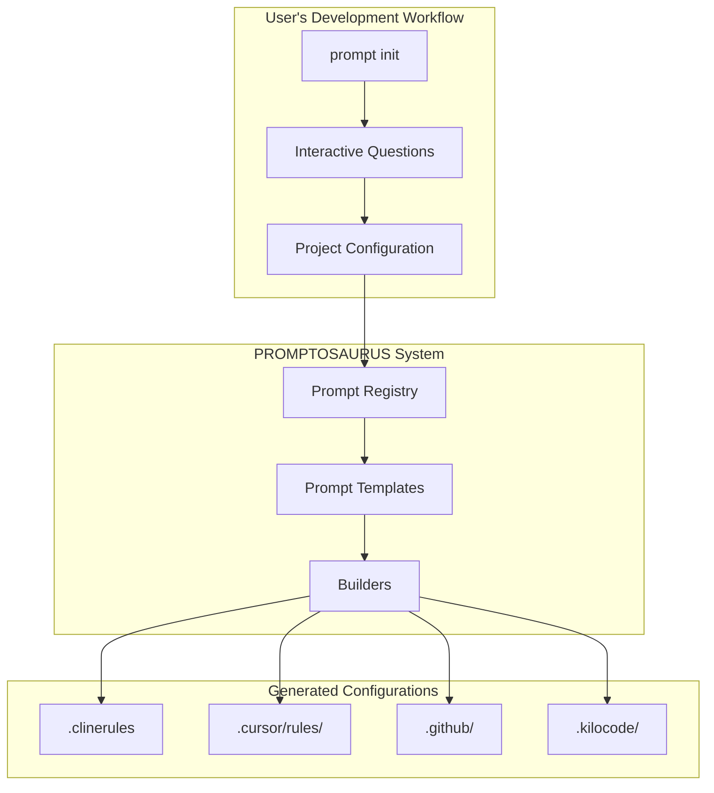
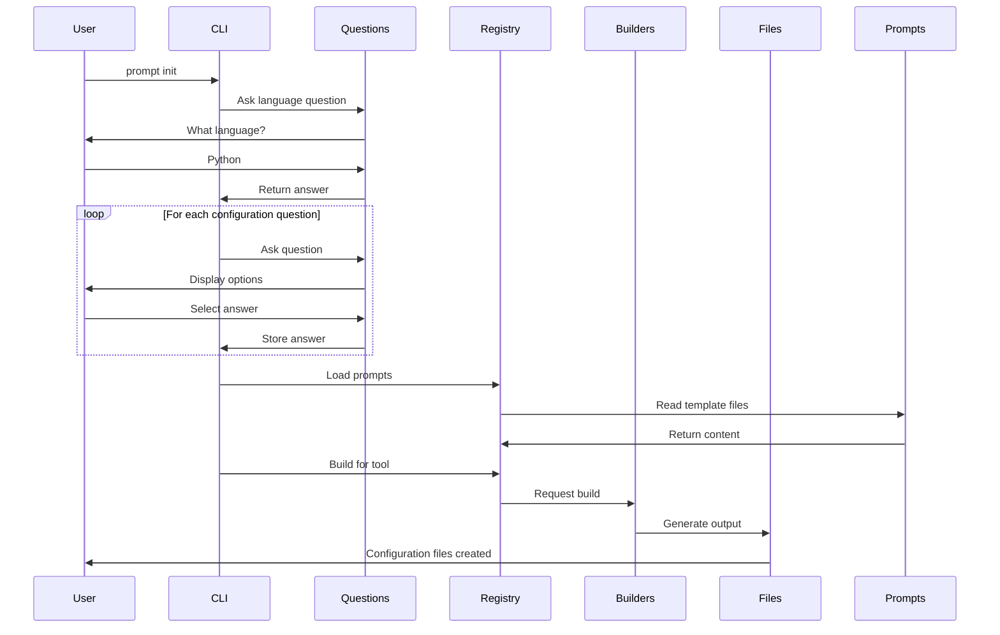
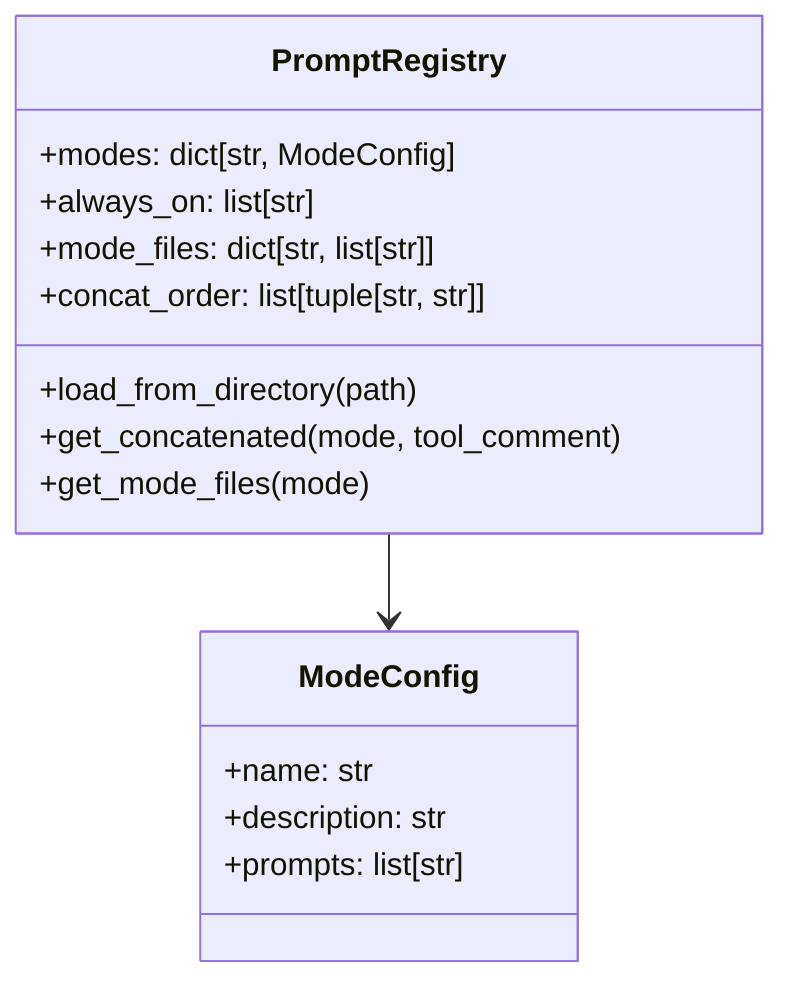
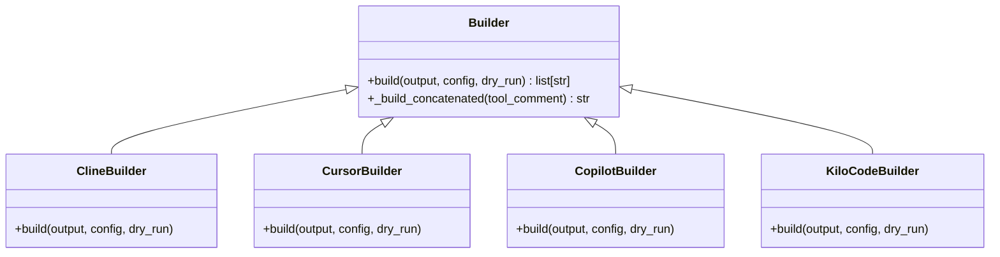
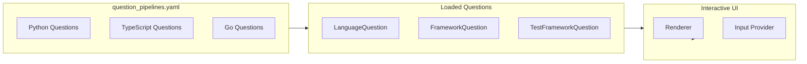
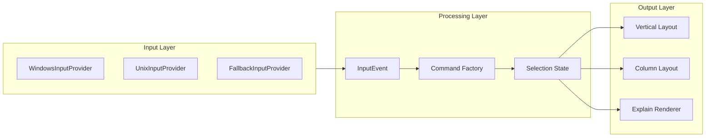

# PROMPTOSAURUS

The PROMPTOSAURUS package is a powerful CLI tool designed to manage AI assistant configurations across multiple platforms. At its core, it solves a fundamental problem that every development team faces: maintaining consistent instructions for AI assistants while adapting those instructions to work with different AI tools.

## What Problem Does It Solve?

Imagine you're a development team that has carefully crafted a set of coding conventions, architectural guidelines, and best practices. You want your AI coding assistant to follow these rules, but here's the challenge: different AI tools expect their instructions in different formats. Some want a single concatenated file, others want a directory structure with individual files, and some need YAML frontmatter to specify when instructions should apply.

This is exactly the problem PROMPTOSAURUS addresses. It serves as a central hub where you define your AI instructions once, and then it generates the appropriate format for each AI tool you use.

## System Architecture

The following diagram shows how PROMPTOSAURUS fits into your development workflow. The CLI acts as the entry point, which loads your prompt templates from a central registry. These prompts are organized into different "modes" - for example, there's a code mode for writing features, a debug mode for troubleshooting issues, an architect mode for high-level design decisions, and many more. Each mode contains specific instructions relevant to that type of work.



The registry doesn't just store files; it understands the relationships between them. It knows which prompts are "always-on" (like core system instructions that apply to every interaction), and which are mode-specific. This organization allows PROMPTOSAURUS to build exactly the configuration each tool needs.

## How It Works

The system operates through a clean pipeline that starts with your prompts and ends with tool-specific configuration files. Here's the journey your prompts take:



Once the prompts are loaded, the builder system takes over. Builders are specialized classes that transform the central prompt registry into formats specific to each AI tool. There are builders for Cline (formerly Claude Dev), for Cursor, for GitHub Copilot, and for Kilo Code in both CLI and IDE formats. Each builder understands the nuances of its target tool and generates the appropriate file structure.

## The Three Main Components

### The Registry

The registry is the heart of the system. It's a Pydantic-based data model that maintains the complete picture of your prompts: which modes exist, what files belong to each mode, which files are always included, and the order in which files should be concatenated. Using Pydantic wasn't a arbitrary choice - it provides automatic validation ensuring your configuration is always correct, serialization capabilities for easy storage and retrieval, and excellent IDE support through type hints.



The registry also handles the crucial task of reading and processing prompt files. When a prompt file is loaded, the registry strips away metadata headers (like the filename comment and path comment that appear in the source files) to produce clean content for the output files.

### The Builders

Builders transform the registry's content into tool-specific formats. The builder pattern was chosen deliberately because each AI tool has such different requirements that attempting to handle them all in one place would create an unmaintainable mess. Instead, each builder is self-contained and focused on producing exactly what its target tool expects.



Consider the difference between Cline and Cursor outputs. Cline wants a single .clinerules file with all prompts concatenated together - simple and straightforward. Cursor, on the other hand, wants individual .mdc files organized in a specific directory structure, with legacy support through a fallback .cursorrules file. Copilot wants files in the .github directory with YAML frontmatter specifying which files each instruction applies to. Each of these is quite different, and the builder pattern accommodates them all cleanly.

The Kilo builders are particularly interesting because they support two different output formats. The CLI format produces a collapsed structure suitable for OpenCode and Continue, while the IDE format produces a structure optimized for the KiloCode VSCode and JetBrains extensions. Both formats are generated from the same source prompts, demonstrating the flexibility of the builder approach.

### The Questions System

Before generating any configuration files, PROMPTOSAURUS needs to know about your project. The questions system handles this through an interactive CLI that asks you a series of configuration questions. These questions are organized by programming language, so you only see relevant options - if you're working on a Python project, you won't be asked about Java-specific frameworks.



What's powerful about this system is its extensibility. Each question is a class that inherits from a base Question class, which means adding a new question is as simple as implementing a few properties. The questions are loaded dynamically based on a YAML configuration file, so you can add new languages or modify the question pipeline without changing any code.

## The Interactive UI

When you run `prompt init`, you're greeted with an interactive command-line interface that walks you through the configuration process. This UI was built with some interesting design decisions worth understanding.

The UI uses a pipeline architecture that separates input handling from rendering from state management. This separation isn't just academic - it makes the system testable and extensible. Each stage can be developed and tested independently, and new features can be added by plugging in new stages without modifying existing ones.



For input handling, the system abstracts away platform differences. Windows terminals behave differently from Unix terminals, and the UI handles both through different input providers. If a platform isn't supported, there's a fallback provider that uses standard input. The user doesn't notice any of this complexity - they just get a working interface regardless of their environment.

Selection states use the Strategy pattern to support different selection behaviors. There's single selection (choose one option), multi-selection (choose multiple options), and mutual exclusion (choose "none" if nothing applies). Each behavior is implemented as a separate class, making them easy to test and modify independently.

## Usage Example

Here's how you might use PROMPTOSAURUS in practice:

```python
from promptosaurus.builders.cline import ClineBuilder
from pathlib import Path

# Create the builder
builder = ClineBuilder()

# Generate configuration files
actions = builder.build(Path("./my-project"))

# See what was created
for action in actions:
    print(action)
```

This simple code generates a complete .clinerules file and .clineignore file in the specified directory, ready for use with Cline.

### Example: Generating Multiple Tool Configurations

Here's a more comprehensive example that generates configurations for multiple AI tools:

```python
from pathlib import Path
from promptosaurus.builders.cline import ClineBuilder
from promptosaurus.builders.cursor import CursorBuilder
from promptosaurus.builders.copilot import CopilotBuilder
from promptosaurus.builders.kilo.kilo_cli import KiloCLIBuilder

output_dir = Path("./my-project")

# Generate for each tool
tools = [
    ("Cline", ClineBuilder()),
    ("Cursor", CursorBuilder()),
    ("Copilot", CopilotBuilder()),
    ("Kilo CLI", KiloCLIBuilder()),
]

for name, builder in tools:
    print(f"Generating {name} configuration...")
    actions = builder.build(output_dir)
    for action in actions:
        print(f"  {action}")
```

Each builder produces a different file structure optimized for its target tool. Run this code and you'll see how the same source prompts get transformed into completely different output formats.

## Related Documentation

This package documentation focuses on the PROMPTOSAURUS package itself. For deeper dives into specific aspects of the system, see these related documents:

- The [BUILDERS](builders/BUILDERS.md) package documentation covers each builder in detail, explaining the output formats and how to extend them.
- The [QUESTIONS](questions/QUESTIONS.md) documentation explains how to add new configuration questions.
- The [UI](ui/UI.md) documentation details the interactive selection system.
- The main [architecture documentation](../docs/ARCHITECTURE.md) provides a comprehensive view of how all the pieces fit together, including design decisions and rationale.
