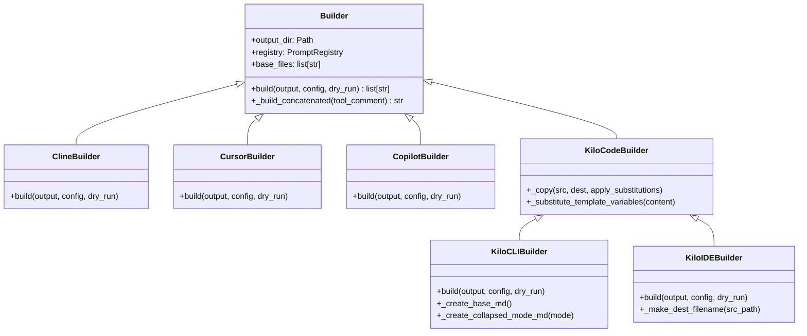
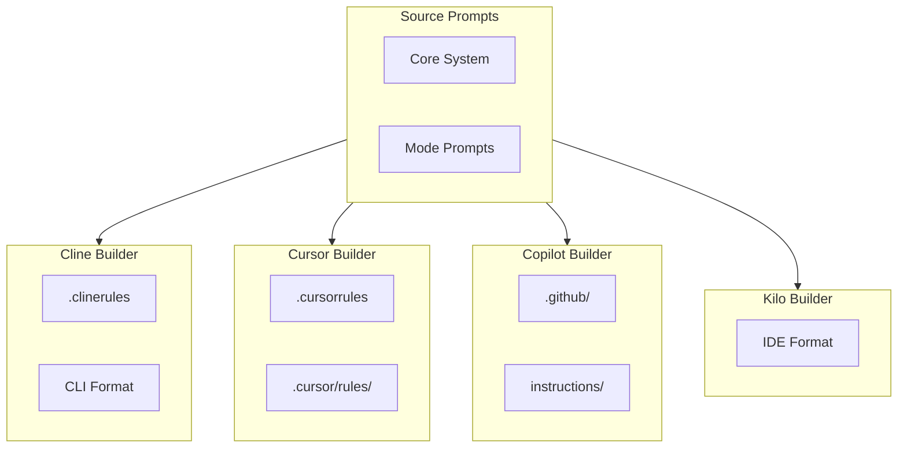
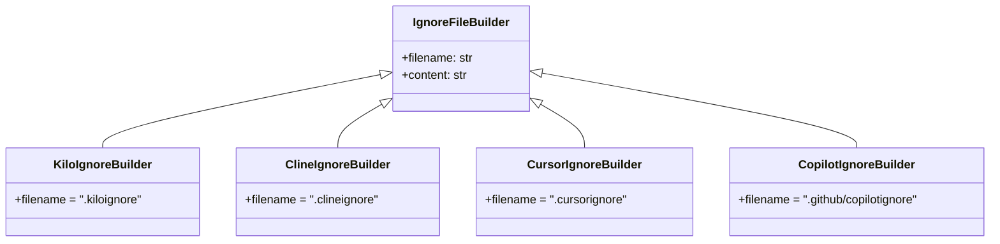

# BUILDERS Package

The BUILDERS package is where the magic happens - it's responsible for taking the central prompt registry and transforming it into configuration files that each AI tool can understand. Without builders, PROMPTOSAURUS would just be a fancy file reader. With builders, it becomes a multi-tool configuration generator.

## The Builder Philosophy

The builder pattern was chosen for a specific reason: each AI assistant tool has such different requirements that trying to handle them all in one place would create an unmaintainable mess. Instead, each builder is a self-contained class that understands exactly what its target tool expects.

Think of it like a translation service. You have your original content (the prompts), and you need to translate it into multiple languages (the output formats). Each translator specializes in one language and knows all the nuances of that language. The builders work the same way - each one specializes in producing output for a specific AI tool.

## Builder Hierarchy

The following diagram shows the class hierarchy of all builders. The base Builder class defines the common interface, and each subclass implements tool-specific logic:



## Understanding the Base Builder

Every builder inherits from the [`Builder`](builder.py) class, which establishes the common interface. This isn't an abstract base class in the traditional sense - it uses the Interface Pattern with NotImplementedError instead. This approach was chosen to keep the code simpler while still providing runtime protection against missing implementations.

The base class establishes two key concepts. First, there's a set of "base files" - these are the core prompt files that should always be included regardless of which mode you're building for. Second, there's the `_build_concatenated` method, which handles the common task of combining multiple prompt files into a single output with clear section headers.

When a builder calls `_build_concatenated`, it gets back a complete string that can be written to a file. The method automatically adds timestamp comments showing when the file was generated, section headers for each prompt, and handles missing files gracefully by including error messages in the output rather than crashing.

## Output Format Comparison

Different AI tools expect different file structures. The following diagram shows what each builder produces:



Here's a detailed comparison table:

| Builder | Output File | Structure | Best For |
|---------|-------------|-----------|----------|
| ClineBuilder | `.clinerules` | Single concatenated file | CLI tools |
| CursorBuilder | `.cursor/rules/*.mdc` | Per-mode directories | VSCode extension |
| CopilotBuilder | `.github/copilot-instructions.md` | YAML frontmatter | GitHub integration |
| KiloCLIBuilder | `.opencode/rules/*.md` | Collapsed mode files | OpenCode, Continue |
| KiloIDEBuilder | `.kilocode/rules-*/` | Mode directories | VSCode, JetBrains |

## Tool-Specific Builders

### Cline Builder

The [ClineBuilder](cline.py) is the simplest of the bunch, perfect for understanding how builders work. Cline (formerly known as Claude Dev) expects a single file called `.clinerules` that contains all prompts concatenated together, plus a `.clineignore` file for patterns to exclude.

What makes this builder interesting is its simplicity. It doesn't need to worry about directory structures or multiple files - it just concatenates everything and writes it out. The ignore file is handled by delegating to a `ClineIgnoreBuilder` that knows what patterns Cline cares about.

**Example output structure:**
```
my-project/
├── .clinerules          # All prompts concatenated
└── .clineignore         # Ignore patterns
```

### Cursor Builder

The [CursorBuilder](cursor.py) is more sophisticated because Cursor has a more complex structure. It wants individual `.mdc` files (Markdown Cursor files) organized in a specific way. Core system prompts go in the root `.cursor/rules/` directory, while mode-specific prompts go into subdirectories like `.cursor/rules/code/`.

The builder handles this complexity by iterating through the registry's mode files and creating the appropriate directory structure. It also maintains a legacy `.cursorrules` file as a fallback, which is useful for older versions of Cursor that don't support the directory structure.

**Example output structure:**
```
my-project/
├── .cursorrules                    # Legacy fallback
└── .cursor/
    └── rules/
        ├── system.mdc              # Core system prompts
        ├── code/
        │   └── feature.mdc         # Code mode prompts
        ├── debug/
        │   └── root-cause.mdc     # Debug mode prompts
        └── document/
            └── docs.mdc            # Document mode prompts
```

### Copilot Builder

The [CopilotBuilder](copilot.py) works with GitHub Copilot, which has yet another format requirement. Copilot expects files in the `.github/` directory with a specific naming convention. The builder creates `copilot-instructions.md` for always-on rules and individual files in the `instructions/` subdirectory for mode-specific rules.

What makes Copilot interesting is its use of YAML frontmatter. Each instruction file starts with a `---` block that includes an `applyTo` field. This tells Copilot which files the instructions should apply to - for example, you might have instructions that only apply to Python files, or only to test files.

**Example output structure:**
```
my-project/
└── .github/
    ├── copilot-instructions.md     # Always-on rules
    └── instructions/
        ├── code.md                 # Code mode prompts
        ├── debug.md                # Debug mode prompts
        └── python.md               # Language-specific
```

**Example with YAML frontmatter:**
```yaml
---
applyTo: "**/*.py"
---

# Python-specific coding conventions
## Naming Conventions
Use snake_case for functions and variables...
```

## The Ignore System

All these builders share a common need: to generate ignore files that tell the AI tool which files to skip. This is handled by the [IgnoreFileBuilder](ignore_generator.py) system, which uses inheritance to provide different ignore content for each tool.



The base class [`IgnoreFileBuilder`](ignore_generator.py) defines the interface - a `filename` property and a `content` property. Each subclass implements these for its specific tool. The `KiloIgnoreBuilder` generates `.kiloignore`, the `ClineIgnoreBuilder` generates `.clineignore`, and so on.

The actual ignore patterns come from the registry, which knows what types of files each tool should ignore. This keeps the ignore logic centralized rather than duplicated across builders.

## Shared Utilities

The [utils](utils.py) module provides helpers used across builders. The most important is `HeaderStripper`, which removes those metadata headers from prompt files before they're included in output. When you look at a prompt file in the source, you'll see comments at the top like `# agents/core/core-system.md` and `<!-- path: ... -->`. These are useful in the source but shouldn't appear in the generated output - HeaderStripper removes them.

The module also includes a cached function for reading prompt files, which improves performance when the same file is accessed multiple times during a build.

## Configuration

The [KiloConfig](config.py) class handles loading YAML configuration for Kilo builders. This isn't strictly a builder itself - it's a supporting class that provides the configuration data builders need.

KiloConfig uses lazy loading, which means it doesn't actually read the YAML files until you access the properties. This is a performance optimization - if you never need the mode configurations, the files are never read. The class also supports custom paths, which is useful for testing or when you want to use non-standard configuration locations.

## Usage Example

Here's how you might use a builder in your code:

```python
from pathlib import Path
from promptosaurus.builders.cline import ClineBuilder
from promptosaurus.registry import PromptRegistry

# Set up the registry
registry = PromptRegistry()
registry.load_from_directory(Path("./prompts"))

# Create and run the builder
builder = ClineBuilder(registry=registry)
actions = builder.build(
    output=Path("./my-project"),
    config=None,  # Optional configuration
    dry_run=False
)

# See what files were created
for action in actions:
    print(action)
```

## See Also

This documentation covers the general builder system. For details on Kilo-specific builders, see the [KILO](kilo/KILO.md) submodule documentation. For the main PROMPTOSAURUS package overview, see the parent [PROMPTOSAURUS](../PROMPTOSAURUS.md) documentation.
