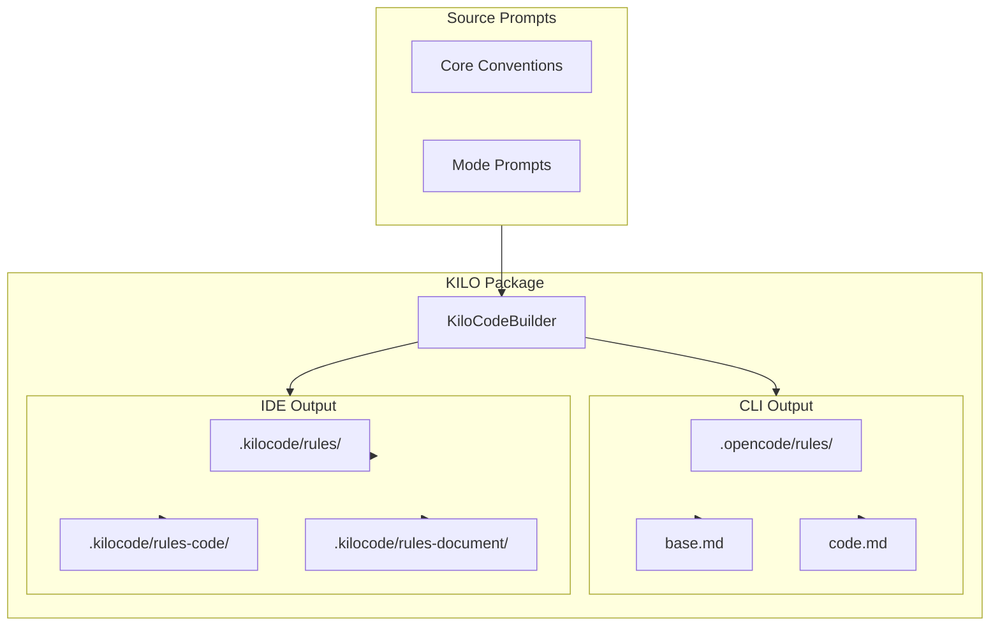
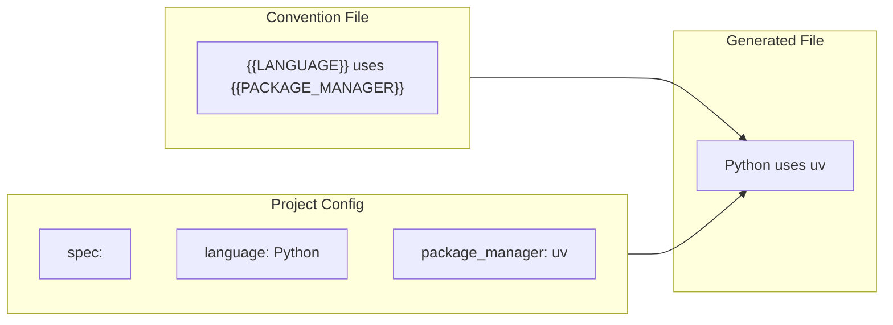
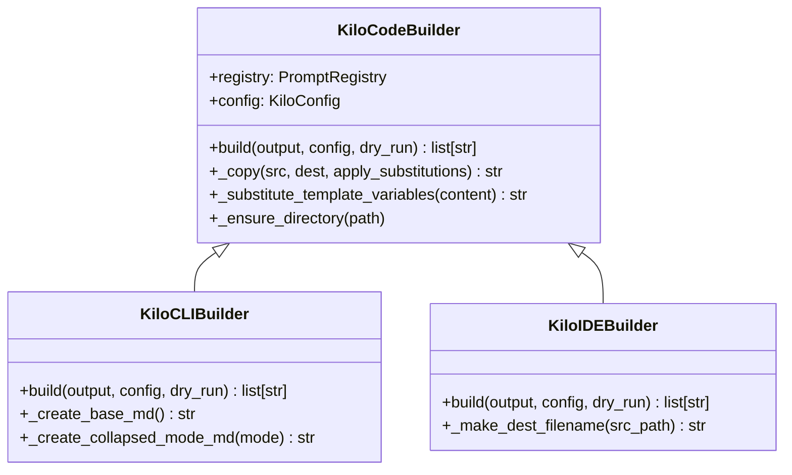
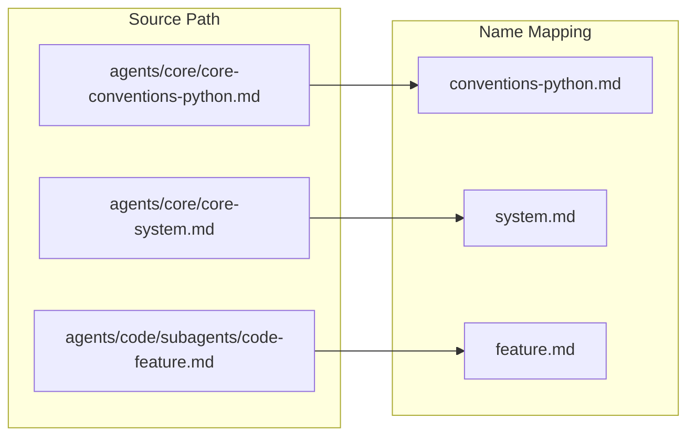
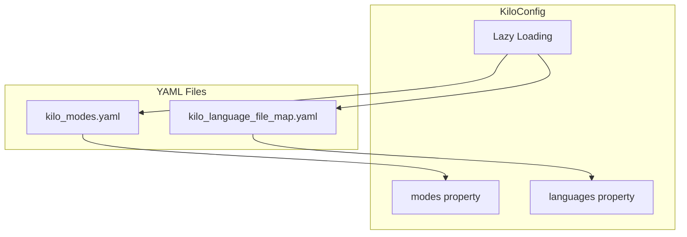

# KILO Package

The KILO submodule specializes in generating configuration for Kilo Code - an AI assistant that can work in both command-line and IDE environments. This dual-target capability means Kilo needs not just one output format, but two different structures optimized for different use cases.

## Two Formats, One Source

Kilo Code operates in two modes. In CLI mode, it works with OpenCode and Continue, which expect a collapsed directory structure where all prompts for a mode are combined into single files. In IDE mode, it works with VSCode and JetBrains extensions, which prefer separate files organized into mode-specific directories.



The KILO package handles both formats through two different builder classes that share common infrastructure. The [`KiloCLIBuilder`](kilo_cli.py) produces the CLI format, while the [`KiloIDEBuilder`](kilo_ide.py) produces the IDE format. Both builders inherit from [`KiloCodeBuilder`](kilo_code_builder.py), which provides the shared functionality they need.

## Template Variable Substitution

One of the most powerful features of the KILO builders is template variable substitution. Language convention files like core conventions can contain placeholders like `{{LANGUAGE}}` or `{{LINTER}}` that get replaced with actual values from the project configuration.



This approach solves a real problem. Without template substitution, you'd need separate convention files for each language - one for Python, one for TypeScript, and so on. With template substitution, you have one file that adapts to the context. The placeholder `{{LANGUAGE}}` becomes "Python" in a Python project, "TypeScript" in a TypeScript project, and so on.

The substitution logic handles various value types. Simple strings are inserted directly. Lists are converted to comma-separated strings. Coverage targets get converted to percentage values. This flexibility means convention files can express sophisticated configuration that adapts to each project.

### Supported Template Variables

| Variable | Description | Example |
|----------|-------------|---------|
| `{{LANGUAGE}}` | Programming language | Python |
| `{{RUNTIME}}` | Runtime version | 3.11 |
| `{{PACKAGE_MANAGER}}` | Package manager | uv |
| `{{LINTER}}` | Linter tool | ruff |
| `{{FORMATTER}}` | Formatter tool | ruff |
| `{{LINE_COVERAGE_%}}` | Line coverage target | 80 |
| `{{BRANCH_COVERAGE_%}}` | Branch coverage target | 70 |

## The Base Builder

[`KiloCodeBuilder`](kilo_code_builder.py) provides the foundation that both output formats share. It handles the mechanics of copying files, creating directories, and applying template substitution. It also manages the manifest file that tells the IDE which modes are available.



The `_copy` method is used extensively throughout the builders. It handles copying a source file to a destination while optionally applying template substitution. If the source is a core conventions file and configuration is provided, the method reads the content, applies substitutions, and writes the result. Otherwise, it performs a straightforward file copy.

The `_substitute_template_variables` method does the heavy lifting for template replacement. It maintains a mapping of template variables to their replacement values, pulling from the configuration's "spec" section. It also handles coverage presets - instead of specifying every coverage target individually, you can specify "strict", "standard", or "minimal" and get appropriate defaults for each.

## CLI Format

The [`KiloCLIBuilder`](kilo_cli.py) produces output optimized for command-line usage. The structure is flat and simple: an AGENTS.md file for documentation, a collapsed base rules file, and collapsed mode files.

**Example output structure:**
```
my-project/
├── AGENTS.md                    # Documentation
├── opencode.json                # File ordering
└── .opencode/
    └── rules/
        ├── base.md              # All core conventions
        ├── code.md              # Code mode prompts
        ├── debug.md             # Debug mode prompts
        └── document.md          # Document mode prompts
```

Collapsed files are a key concept here. Rather than having many small files, related prompts are combined into single files. This works well for CLI tools that load all instructions at startup - one file to load is more efficient than many.

The `_create_base_md` method builds the collapsed base file by concatenating core convention files. It strips any metadata headers from the source files and joins them with clear separators. The `_create_collapsed_mode_md` method does the same thing for mode-specific files.

The opencode.json file tells the CLI tool which files to load and in what order. The builder generates this automatically based on the available modes and files.

## IDE Format

The [`KiloIDEBuilder`](kilo_ide.py) produces output optimized for IDE extensions. The structure is more granular, with separate files for each prompt rather than collapsed combinations.

**Example output structure:**
```
my-project/
├── .kilocode/
│   ├── modes.yaml               # Mode definitions
│   └── rules/
│       ├── system.md            # Core system prompts
│       ├── session.md           # Session management
│       ├── conventions.md       # Base conventions
│       ├── conventions-python.md
│       ├── rules-code/
│       │   ├── code.md         # Code mode
│       │   └── feature.md      # Code features
│       ├── rules-document/
│       │   ├── document.md     # Document mode
│       │   └── docs.md         # Documentation
│       └── rules-debug/
│           └── debug.md        # Debug mode
```

IDE extensions work differently from CLI tools. They can load files on demand based on what the user is working on. This means having separate files is actually beneficial - the IDE can load only what's needed for the current context rather than loading everything at once.

The structure puts core files in `.kilocode/rules/` where they're always loaded. Mode-specific files go into directories like `.kilocode/rules-code/` and `.kilocode/rules-document/`, with the mode name as part of the directory. This organization makes it easy for the IDE to find and load the right files.

## File Name Mapping

The `_make_dest_filename` function handles the tricky task of converting source prompt paths to appropriate destination names. The source structure uses a nested directory under `agents/`, but the output needs to be flatter and more tool-friendly.



The function handles several cases. Core convention files like `agents/core/core-conventions-python.md` become just `conventions-python.md` in the output. Core system files like `agents/core/core-system.md` become `system.md`. Subagent files lose their agent prefix - `agents/code/subagents/code-feature.md` becomes `feature.md`.

This name mapping is essential for making the output structure clean and navigable. Without it, you'd end up with deeply nested directories that are hard to work with.

## Configuration Loading

The [`KiloConfig`](config.py) class manages loading the YAML configuration files that define available modes and language mappings. It uses lazy loading to defer file I/O until the properties are actually accessed - this is a performance optimization for cases where the configuration isn't needed.



The configuration includes custom mode definitions from kilo_modes.yaml and language file mappings from kilo_language_file_map.yaml. These files define what modes are available and which convention files to use for each programming language.

## Usage Example

Here's how you might use the KILO builders:

```python
from pathlib import Path
from promptosaurus.builders.kilo.kilo_cli import KiloCLIBuilder
from promptosaurus.builders.kilo.kilo_ide import KiloIDEBuilder
from promptosaurus.builders.kilo.config import KiloConfig

# Load configuration
config = KiloConfig()

# Create CLI builder
cli_builder = KiloCLIBuilder()

# Create IDE builder
ide_builder = KiloIDEBuilder()

# Build for CLI (OpenCode, Continue)
cli_actions = cli_builder.build(
    output=Path("./my-project"),
    config=config,
    dry_run=False
)

# Build for IDE (VSCode, JetBrains)
ide_actions = ide_builder.build(
    output=Path("./my-project"),
    config=config,
    dry_run=False
)

print("CLI files created:", len(cli_actions))
print("IDE files created:", len(ide_actions))
```

## See Also

For the general BUILDERS documentation, see the parent [BUILDERS](../BUILDERS.md). For the main PROMPTOSAURUS overview, see [PROMPTOSAURUS](../PROMPTOSAURUS.md).
