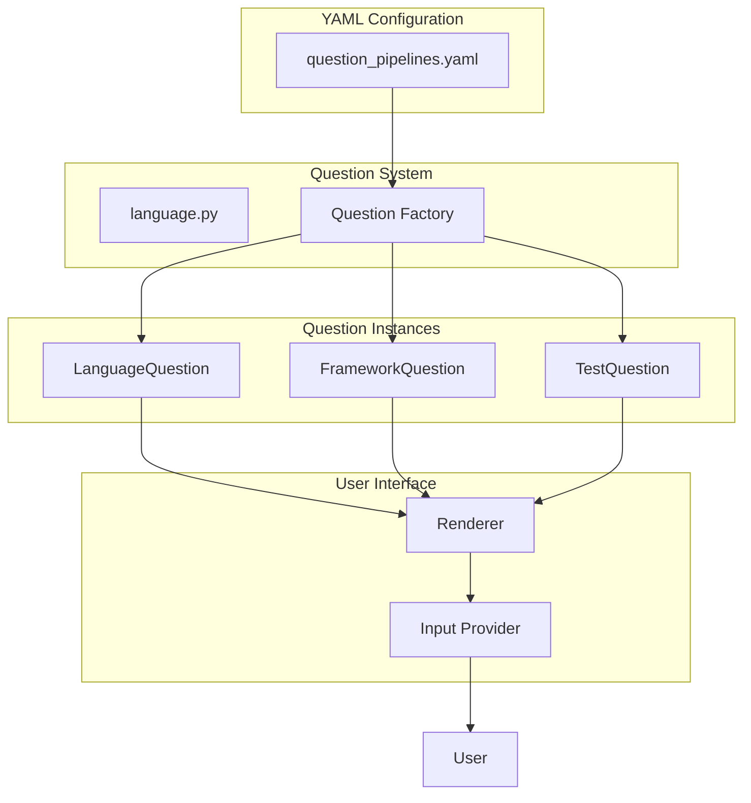
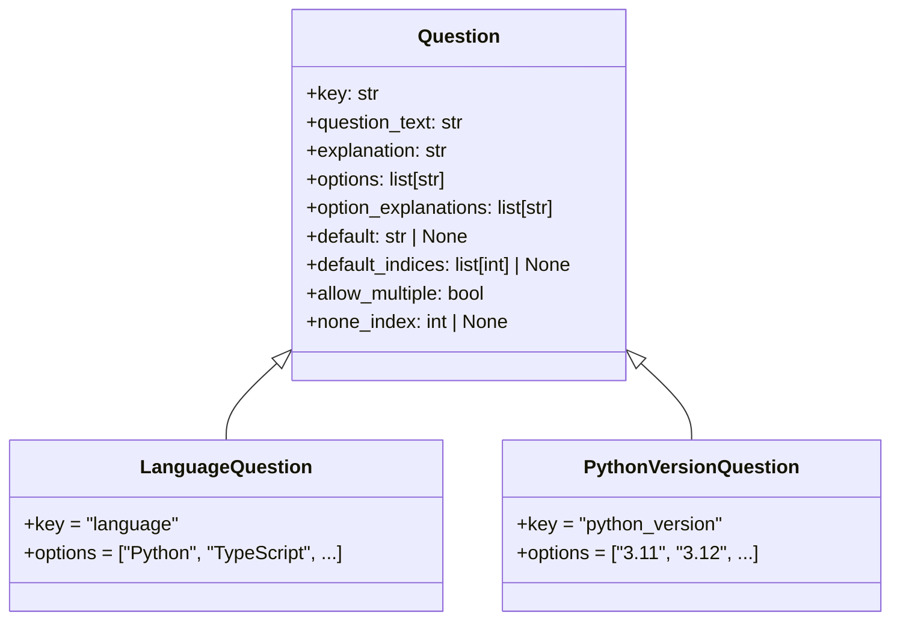
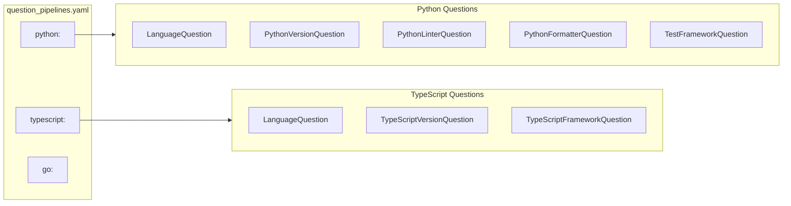
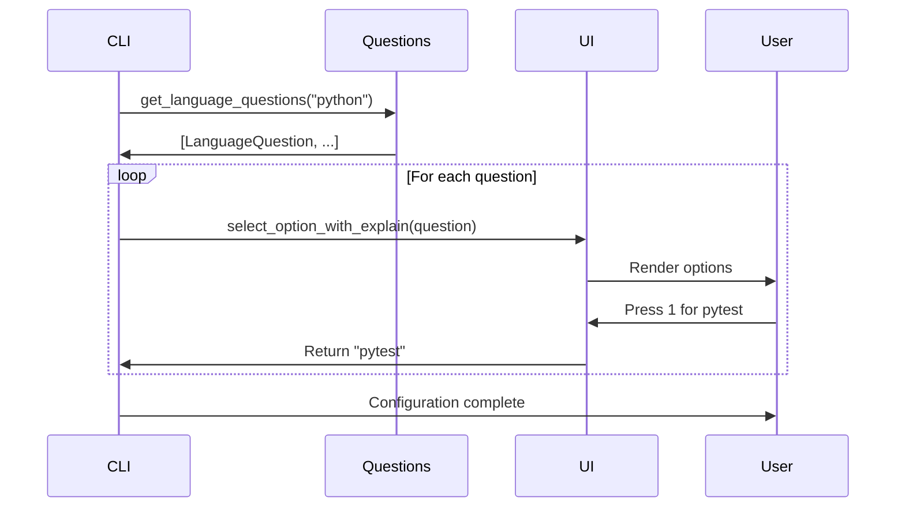

# QUESTIONS Package

The QUESTIONS package is what makes PROMPTOSAURUS interactive. Before generating any configuration files, the system needs to understand the project it's working with - what programming language is being used, what frameworks, what testing approaches. The questions system handles this discovery process through an engaging CLI experience.

## Why Questions Matter

Configuration isn't something that should be guessed or assumed. A Python project has different needs than a TypeScript project. A project using pytest has different testing requirements than one using unittest. Rather than hardcoding defaults or requiring users to manually edit configuration files, PROMPTOSAURUS asks interactive questions to understand the project context.

This approach has several advantages. First, it guides users through the setup process rather than leaving them to figure things out on their own. Second, it ensures the generated configuration is appropriate for the specific project. Third, it surfaces important decisions that might otherwise be overlooked.

## Question Architecture

The following diagram shows how questions are loaded and executed:



## The Question Abstraction

At the heart of the system is the [`Question`](base/question.py) abstract base class. Every question is a class that implements a small set of properties. The `key` property provides a unique identifier - this is how the answer gets stored in the configuration. The `question_text` is what the user sees when asked the question. The `explanation` provides context about why this question matters.



The most important property is `options`, which defines what choices the user can pick from. But that's not all - there's also `option_explanations` which provides additional context for each option, helping users make informed decisions. A user choosing between linters, for instance, benefits from understanding what each linter emphasizes.

The system supports defaults through the `default` and `default_indices` properties. Rather than requiring users to make every decision, sensible defaults are provided for common cases. Users can simply press Enter to accept defaults or explicitly select different options.

## Language Organization

One of the most powerful features is how questions are organized by programming language. When you select Python as your language, you get Python-specific questions. Select TypeScript, and you get TypeScript-specific questions. This prevents the overwhelm of seeing options that aren't relevant to your project.



Under the hood, this works through a YAML configuration file called [`question_pipelines.yaml`](question_pipelines.yaml). This file maps each language to a list of question class names. When the system needs questions for Python, it looks up the Python entry in the YAML and instantiates each listed class.

This architecture means adding support for a new language doesn't require changing code - you just add an entry to the YAML file and create the appropriate question classes. Similarly, you can customize the questions for existing languages by editing the YAML.

## The Question Factory

The [`language`](language.py) module contains the logic for loading and instantiating questions. The `get_language_questions` function is the main entry point - you pass it a language name and it returns a list of Question instances ready to be asked.

```python
from promptosaurus.questions.language import get_language_questions

# Get questions for a specific language
questions = get_language_questions("python")

# questions is now a list of Question instances:
# [LanguageQuestion, PythonVersionQuestion, PythonLinterQuestion, ...]
```

The function uses the AbstractFactory pattern to instantiate classes dynamically. This means question classes can be registered once and then created by name without explicit imports. It's a decoupled approach that makes the system flexible.

Error handling is important here. If a question class is referenced in the YAML but can't be instantiated - maybe the class was renamed or removed - the system raises a `QuestionPipelineError` with clear information about what went wrong. This makes debugging configuration issues much easier.

## Question Types

The base Question class provides a foundation, but different situations call for different behaviors. The `allow_multiple` property enables multi-select questions where users can pick several options. The `none_index` property enables mutual exclusion, where selecting "none of the above" automatically deselects everything else.

```mermaid
flowchart TB
    subgraph Single["Single Selection"]
        Q1["Choose one: A, B, or C"]
        S1["User selects: B"]
        S2["Result: {B}"]
    end["Multi
    
    subgraph Multi Selection"]
        Q2["Choose all that apply: A, B, C"]
        S3["User selects: A, C"]
        S4["Result: {A, C}"]
    end
    
    subgraph Mutual["Mutual Exclusion"]
        Q3["Select (A, B, C, or None)"]
        S5["User selects: None"]
        S6["Result: {} (all deselected)"]
    end
```

These aren't just boolean flags - they trigger different UI behaviors. A multi-select question allows toggling individual options and requires different Enter key handling. A mutual exclusion question ensures consistent state no matter what order users make their selections in.

## Creating Custom Questions

If the built-in questions don't cover your needs, you can create custom questions. The process is straightforward: create a class that inherits from Question, implement the required properties, and add your class to the question pipeline YAML.

```python
from promptosaurus.questions.base.question import Question

class CustomLintingRulesQuestion(Question):
    """Question about additional linting rules to enable."""
    
    @property
    def key(self) -> str:
        return "custom_linting_rules"
    
    @property
    def question_text(self) -> str:
        return "Which additional linting rules should be enabled?"
    
    @property
    def explanation(self) -> str:
        return "These rules enforce team-specific coding standards."
    
    @property
    def options(self) -> list[str]:
        return [
            "Strict null checks",
            "Immutability requirements",
            "Naming conventions",
            "All of the above"
        ]
    
    @property
    def option_explanations(self) -> list[str]:
        return [
            "Enable strict null/undefined checking",
            "Require readonly props and const",
            "Enforce naming style consistency",
            "Enable all custom rules"
        ]
```

For example, if your team has specific coding standards you want to enforce, you might create a question that asks which custom rules to enable. The question would list your team's custom rules as options, with explanations describing what each rule does. When users run the init process, they'll see your custom question alongside the standard ones.

## Integration with the UI

The questions system doesn't exist in isolation - it works closely with the UI package to present questions to users and collect answers. Each question is rendered using one of the UI's renderers, and user input is collected through the UI's input providers.



This integration is seamless from the user's perspective. They run `prompt init`, select their language, and then work through a series of questions. Each question appears with its options, explanations, and clear instructions. The answers are collected and used to configure the subsequent file generation.

## See Also

For the main PROMPTOSAURUS package overview, see the parent [PROMPTOSAURUS](../PROMPTOSAURUS.md) documentation. For details on the interactive UI system that presents these questions, see the [UI](ui/UI.md) package documentation.
