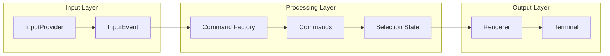
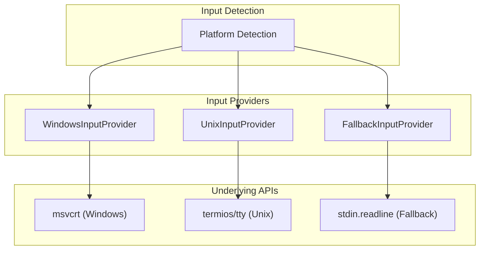
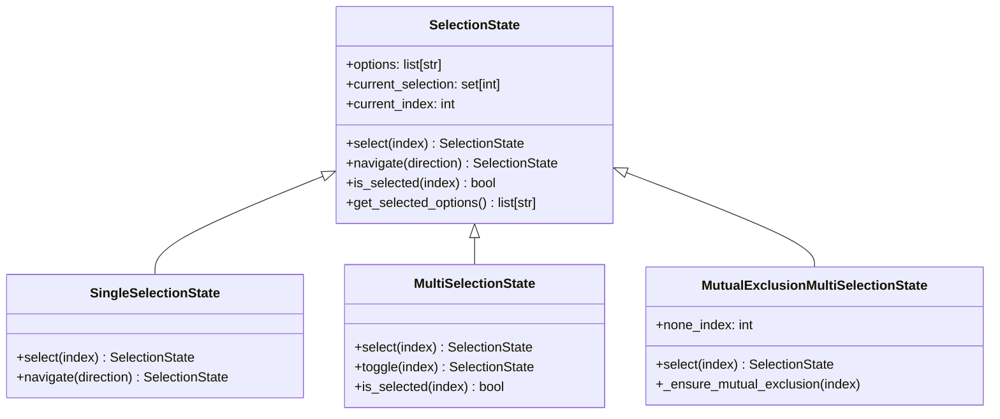
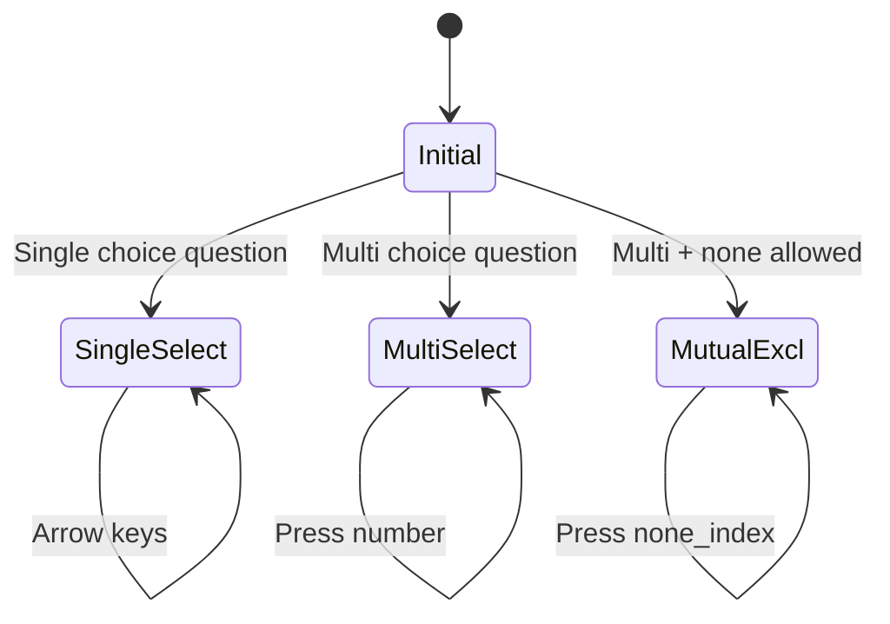
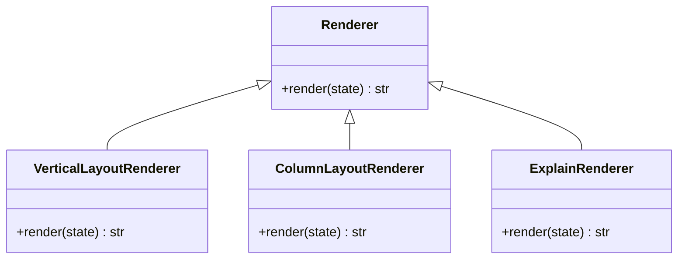

# UI Package

The UI package is what makes PROMPTOSAURUS interactive. When users run `prompt init`, they're presented with a series of questions about their project. The UI package handles everything from detecting keypresses to rendering the selection menu to managing the selection state. It's a complete mini-application within the larger system.

## Design Philosophy

Building a CLI UI that works reliably across different platforms and terminal types is surprisingly complex. The UI package tackles this complexity through careful separation of concerns. Rather than having one large file that handles input, output, and state, the system is divided into distinct layers that each handle one aspect of the problem.

The three main layers are input, processing, and output. Input handles detecting what keys the user presses. Processing converts those keypresses into meaningful commands and updates state accordingly. Output takes the current state and renders it to the terminal. Each layer can be developed and tested independently, and each can be swapped out without affecting the others.

## Pipeline Architecture

At the core of the UI is a pipeline architecture inspired by stream processing. Data flows through a series of stages, each transforming the data in some way before passing it to the next stage. This isn't just academic - it makes the system testable and extensible.



The pipeline starts with an InputProvider, which is responsible for reading keystrokes from the terminal. Different providers exist for different platforms - there's a WindowsInputProvider that uses the msvcrt library, a UnixInputProvider that uses termios, and a FallbackInputProvider for anything else. The correct provider is selected automatically based on the operating system.

The InputProvider doesn't return raw keycodes - it converts them into InputEvent objects. This abstraction means the rest of the system doesn't need to know about the differences between Windows and Unix key handling. An up-arrow is always represented the same way regardless of how it was detected.

Events flow from the input provider to a CommandFactory, which interprets them as commands. A number key becomes a Select command, arrow keys become Navigate commands, and so on. This translation step is important because it allows the UI behavior to be customized without changing how input is collected.

## Input Providers

The UI supports multiple input modes based on platform. Here's how the different providers work:



1. **Windows**: Uses `msvcrt` for raw keyboard input
2. **Unix**: Uses `termios`/`tty` for raw input
3. **Fallback**: Uses standard `input()` (limited functionality)

On Windows, the msvcrt library provides direct access to console input, allowing detection of individual keypresses without waiting for Enter. On Unix, the termios library provides similar functionality, but the API is completely different. The InputProvider classes encapsulate these differences, presenting a unified interface to the rest of the system.

For platforms that don't fit either category, there's a FallbackInputProvider that uses standard input(). It's less elegant - users have to press Enter after each key - but it works everywhere. This graceful degradation means PROMPTOSAURUS can always run, even on unusual platforms.

## Selection States

Once a command is understood, it needs to be applied to the current state. This is where the selection state classes come in. They implement the Strategy pattern - different classes implement the same interface but with different behaviors.



**SingleSelectionState** is what you'd expect from a typical multiple-choice question. Only one option can be selected at a time. Pressing a number key selects that option. Arrow keys navigate the selection cursor. The state is immutable - each operation returns a new state object rather than modifying the existing one.

**MultiSelectionState** allows selecting multiple options. This is useful for questions like "Which frameworks do you use?" where more than one answer might apply. Each key press toggles the corresponding option on or off. Arrow keys don't do anything meaningful in this mode since there's no single "current" selection to move around.

**MutualExclusionMultiSelectionState** adds another dimension: the ability to have a "none of the above" option that automatically deselects everything else. If you've ever been frustrated by a multi-select that didn't let you say "none of these apply," you'll appreciate why this exists.

### State Transitions

Here's how state changes based on user input:



## Rendering

The final piece of the puzzle is rendering - taking the current state and displaying it to the user. Different renderers handle different display scenarios.



**VerticalLayoutRenderer** works well for a small number of options. It displays them in a simple vertical list with numbers, explanations, and selection indicators. This is the most common case and the default for questions with eight or fewer options.

**ColumnLayoutRenderer** kicks in when there are many options. Instead of a long vertical list that requires scrolling, it organizes options into columns. This makes efficient use of terminal space and keeps everything visible at once.

**ExplainRenderer** takes over when the user wants more information about an option. Rather than showing the full list, it displays detailed explanation text. This helps users understand what each option means before making a choice.

### Example Output

**Vertical Layout (≤8 options):**
```
1. pytest      - Python testing framework
2. unittest    - Built-in testing framework
3. hypothesis  - Property-based testing
>
```

**Column Layout (>8 options):**
```
1. pytest      5. tox         9. nose2
2. unittest   6. nose        10. doctest
3. hypothesis 7. coverage    
4. pytest-cov 8. mock        
>
```

**Explain View:**
```
══════════════════════════════════════════════════════
PYTEST
══════════════════════════════════════════════════════

pytest is the most popular Python testing framework.
It emphasizes simplicity and scalability.

Features:
• Simple syntax for writing tests
• Rich plugin ecosystem
• Excellent assertion introspection
• Strong community support

[▲] Prev   [Select: Enter]   [▼] Next
```

## Event Types

The UI recognizes several types of events that can be triggered by keypresses:

| Event | Key | Action |
|-------|-----|--------|
| NUMBER | 0-9 | Select option by index |
| UP | Arrow Up / k | Navigate to previous option |
| DOWN | Arrow Down / j | Navigate to next option |
| ENTER | Return | Confirm selection |
| EXPLAIN | e | Show detailed explanation |
| QUIT | q / Esc | Cancel and exit |

## Usage

Most users will never interact with the UI package directly. They run the CLI, answer questions, and get their configuration files. But for developers extending PROMPTOSAURUS, the UI provides hooks at every level.

The main entry point is [`select_option_with_explain`](_selector.py), which presents a question with options and explanations. It handles the entire flow from rendering the first display through collecting user input to returning the final selection. For simpler needs, there are convenience functions like `confirm_interactive` for yes/no questions.

```python
from promptosaurus.ui import select_option_with_explain

# Present a question to the user
result = select_option_with_explain(
    question_text="Which testing framework?",
    options=["pytest", "unittest", "hypothesis"],
    option_explanations=[
        "Popular, feature-rich testing framework",
        "Built-in Python testing framework",
        "Property-based testing library"
    ]
)

print(f"User selected: {result}")
```

The public API is deliberately simple. Behind the scenes, it creates the appropriate pipeline components, runs the selection flow, and returns the result. This means adding new features to the UI doesn't require changing how users interact with it.

## See Also

For the main PROMPTOSAURUS package overview, see the [PROMPTOSAURUS](../PROMPTOSAURUS.md) documentation. For understanding how the questions system uses this UI, see the [QUESTIONS](questions/QUESTIONS.md) documentation.
